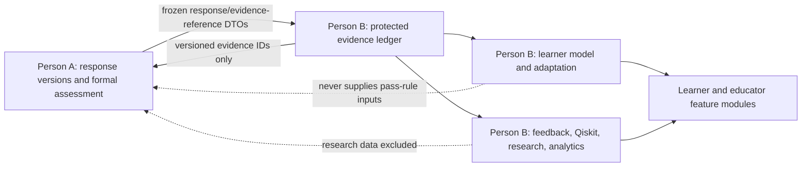

# 001: Implement Person B evidence, platform, research, and release workstream

Status: approved for sequential implementation

Owner: Person B

Created: 2026-08-14

Target branch: `codex/person-b-platform` (created from verified `main` at `52d45828f0a6e528a9a5736c4cc2a0cdc0009f6a` after `git pull --ff-only origin main` reported `Already up to date`)

## Outcome

Implement the complete Person B workstream defined by B1 to B7 in
`docs/05-two-person-implementation-split.md`: establish a truthful baseline; add append-only
learning evidence and safe learner-model history; complete task, Qiskit, feedback, adaptation,
misconception, progress, gamification, research, and analytics modules; and produce the automated
and manual-evidence framework needed for release assessment.

The completed workstream will provide Person A with versioned, opaque evidence references and
independently tested platform modules. It will never calculate, confirm, override, or display a
formal learner assessment result. Research condition, demographics, confidence, time, retries,
hints, points, access support, learner-model estimates, and other Person B data will be structurally
excluded from Person A's formal pass rule.

This plan does not:

- Edit the shared files assigned exclusively to Person A in
  `docs/05-two-person-implementation-split.md:36-54`.
- Define or implement formal `PASS`/`INCOMPLETE` calculation, assessor confirmation, override,
  voiding, or reassessment policy.
- Guess unresolved live-pilot policies such as retention periods, consent wording, reassessment
  rules, assessor assignment, evaluator release thresholds, or escalation service targets.
- Claim native Safari, screen-reader, production load, hosted TLS, external model accuracy,
  usability-study, or availability evidence unless those checks are actually run in a suitable
  environment.
- Delete legacy learner records or translate numeric learner scores into `PASS` without an
  assessor-approved mapping owned by Person A.

## Source evidence

| Claim or rule | Evidence | Requirement |
| --- | --- | --- |
| Person B owns evidence, AI support, Qiskit, adaptation, research, analytics, and release proof. | `docs/05-two-person-implementation-split.md:306-523` | B1-B7 |
| Person B must add isolated modules and must not edit Person A's shared LMS, router, generated-contract, or application-shell files. | `docs/05-two-person-implementation-split.md:36-54` | Ownership boundary |
| Person B must not calculate or change a formal learner result. | `docs/05-two-person-implementation-split.md:112-114` | AC19, AT23 |
| Append-only evidence must include revisions, confidence, support, reflection, transfer, and result lifecycle without overwriting earlier evidence. | `docs/01-implementation-requirements.md:344-348`, `docs/01-implementation-requirements.md:396-404` | FR19, FR29, FR30 |
| Adaptations require observable evidence, reasons, uncertainty, versions, and override history while preserving the assessment standard. | `docs/01-implementation-requirements.md:368-372`, `docs/01-implementation-requirements.md:412-418` | FR23, FR32, FR33 |
| Misconceptions are hypotheses with supporting and contradicting evidence, a probe, support, revision, transfer, and uncertain state. | `docs/01-implementation-requirements.md:420-422` | FR34, AC13 |
| Direct identifiers and full learner answers must remain outside general logs. | `docs/02-pass-incomplete-bloom-assessment-spec.md:749` | NFR16 |
| Research condition and consent cannot affect the formal result. | `docs/02-pass-incomplete-bloom-assessment-spec.md:891-893` | AT23 |
| The current role model contains only student, educator, and administrator. | `src-main/backend/app/models/user.py:10-13` | FR1, FR20, AT17 |
| The current Quality Judge namespace uses `PASS` and `FAIL`, conflicting with the new learner-result vocabulary. | `src-main/backend/app/models/enums.py:42-44` | FR17, AT20 |
| Current learning-event persistence is pseudonymous, idempotent, and privacy-bounded, but captures only a small event set and score-bearing submission/completion metadata. | `src-main/backend/app/services/learning_events/service.py:67`, `src-main/backend/app/services/learning_events/service.py:158-219`, `src-main/backend/app/schemas/learning_events.py:89-100` | FR19, FR20, FR29 |
| The existing task registry implements six Boolean-marked task handlers. | `src-main/backend/app/services/task_types.py:63-310` | FR9, PD4, NFR11 |
| Qiskit execution already bounds qubits and shots and rejects unsupported or invalid operations. | `src-main/backend/app/services/quantum.py:26-85` | FR14, PD5, NFR23 |
| Qiskit results do not yet retain Qiskit/Aer versions, a durable run record, prediction linkage, or a hard execution-time contract. | `src-main/backend/app/services/quantum.py:CircuitResult`, `src-main/backend/app/services/quantum.py:simulate_circuit` | FR14, PD5, NFR20, NFR23 |
| Feedback already performs one regeneration and falls back safely after repeated rejection or technical failure. | `src-main/backend/app/services/feedback/pipeline.py:109-289`, `src-main/backend/app/services/feedback/pipeline.py:386-424` | FR18, AC4 |
| The current quality policy is score-threshold based and checks a narrower set than the new pedagogical and accessibility requirements. | `src-main/backend/app/schemas/feedback.py:54-55`, `src-main/backend/app/services/feedback/judge.py:28-139` | FR17, NFR14, NFR28 |
| Durable continuation already exposes privacy-minimal progress and next-task ports, but production evidence/model and recommender adapters are absent. | `src-main/backend/app/services/continuation/contracts.py:51-93`, `src-main/backend/app/services/continuation/service.py:104-272` | FR23, FR30, FR33 |
| Research pairing, fenced baseline execution, measurements, pseudonyms, and fail-closed exports already exist. | `src-main/backend/app/services/research/repository.py:79-442`, `src-main/backend/app/services/research_export.py:116-333` | FR20, NFR16, NFR25 |
| Research eligibility currently has only a protocol and disabled/configured policies; consent, withdrawal, missing-data, and approved-field records are missing. | `src-main/backend/app/services/research/contracts.py:7-26`, `src-main/backend/app/services/feedback/runtime.py:44-47` | BP12-BP14, NFR25, NFR30 |
| Analytics still exposes learner `average_score`; current LMS and frontend views also expose score percentages, numeric mastery, and a leaderboard. | `src-main/backend/app/services/analytics/metrics.py:98-108`, `src-main/backend/app/services/analytics/metrics.py:394-476`, `src-main/frontend/src/features/analytics/LearningSummary.tsx:17`, `src-main/frontend/src/components/AnalyticsView.tsx:163-177` | FR22, FR25, FR39, AC6, AC19 |
| Gamification still awards a `perfect-score` achievement from `attempt.score == 100`. | `src-main/backend/app/services/gamification.py:27-58`, `src-main/backend/app/services/gamification.py:81-149` | FR25, AC14, AC19 |
| Existing Playwright configuration covers Chrome, Edge, Firefox, and WebKit and includes Axe checks, but native Safari and complete manual assistive-technology proof remain external. | `src-main/frontend/playwright.config.ts:1-43`, `src-main/frontend/e2e/person4.e2e.ts:78-170`, `src-main/docs/requirements-traceability.md:81` | NFR4, NFR18, AC17 |
| CI currently defines locked backend tests/coverage, migration and contract checks, frontend lint/test/build/E2E, dependency audits, and Gitleaks. | `.github/workflows/quality.yml:1-185` | NFR10, NFR15, AC9 |
| A backup/restore verifier already compares every SQLite table by record count and content digest. | `src-main/backend/scripts/verify_sqlite_backup.py:create_verified_backup` | NFR5, NFR17 |
| The required root gap matrix is absent; the existing `src-main/docs/requirements-traceability.md` describes the older requirements baseline. | `docs/03-codex-implementation-work-order.md:113-127`, `src-main/docs/requirements-traceability.md:1-24` | Phase 0 gate |
| The two documented analytics failures reproduce in the current backend environment. | `tests/test_analytics_application.py::test_sql_analytics_use_half_open_filters_roster_and_terminal_research`; `tests/test_person4_e2e.py::test_person4_deterministic_end_to_end`; local result on 2026-08-14: `2 failed` | B1, NFR10, AC9 |
| Research rows use wall-clock `created_at`, while analytics applies half-open filters to that field; fixed historical tests therefore exclude otherwise valid rows as wall time advances. | `src-main/backend/app/models/persistence.py:644-648`, `src-main/backend/app/services/research/repository.py:116`, `src-main/backend/app/services/analytics/repository.py:130-135`, `src-main/backend/tests/test_analytics_application.py:26-48` | B1 baseline repair |

## Current-state trace

### Student input to stored activity

1. The shared LMS route accepts task drafts and submissions and calls `LmsService.submit`.
2. `TaskTypeRegistry` validates the selected handler and returns Boolean correctness.
3. Shared LMS code converts correctness into a numeric score and a `passing_score`-based completion
   status, then stores `SubmissionAttempt.score`.
4. `TrustedLearningEventHooks` emits pseudonymous submission and completion records containing the
   numeric score.
5. The frontend displays the percentage, attempt history, average score, concept mastery, and
   points.

This path is `CONFLICTING` with the controlling binary-assessment language. Person A owns removal
of the formal score path. Person B owns replacement evidence, progress, analytics, and gamification
projections and must make those modules usable without importing the formal result engine.

### Feedback, terminal integration, continuation, and research

1. An accepted submission starts a durable feedback workflow.
2. Feedback context gathers the task, response, authorised retrieval evidence, and optional
   simulation evidence.
3. The feedback generator emits structured content; the Quality Judge evaluates it.
4. A rejected first attempt regenerates once; a second rejection or technical failure releases a
   fixed safe fallback while retaining the submission.
5. Terminal feedback atomically prepares metadata-only continuation and research intents.
6. A fenced outbox worker creates continuation work and a paired agentic/baseline research case.
7. Continuation has interfaces for progress persistence and next-task recommendation, but the
   deterministic end-to-end test supplies in-memory adapters; production learner-model and
   adaptation implementations are `MISSING`.
8. Research exports are bounded, pseudonymous, formula-safe, and fail closed on audit failure, but
   durable consent, withdrawal, field approval, and missing-data governance are `MISSING`.

### Evidence and learner model

The current `LearningEvent` stream proves views, draft saves, submissions, feedback views, and
completion. It does not provide the required protected answer artefact, reasoning, prediction,
revision lineage, reflection, support/access distinction, transfer evidence, misconception links,
learner annotations, educator corrections, or versioned learner-model snapshots. Those areas are
`PARTIAL` or `MISSING`.

### Task and simulation support

Six current task handlers provide deterministic scaffolding and Boolean correctness. Prediction,
reflection, transfer/new-context, broad explanation/reasoning, matching/sequencing, and evidence
extractor/export contracts are `MISSING`. Qiskit execution is bounded and user-safe, but durable
simulation provenance, exact engine versions, prediction-before-reveal, execution-time isolation,
and a canonical semantic result contract are `PARTIAL`.

### Progress, adaptation, misconception, and learner control

Score-driven recommendations, progress, mastery, reminders, and gamification exist in shared LMS
code. They do not retain evidence/uncertainty/version lineage, do not support learner or educator
overrides, do not implement the misconception hypothesis cycle, and do not fully account for time
zones, extensions, access plans, preferences, or gamification opt-out. The durable continuation
ports are a useful integration seam; the required modules are otherwise `MISSING` or
`CONFLICTING`.

### Verification state

- Targeted backend baseline: `FAILED` with the two documented research-rate failures.
- Locked `uv run --frozen ...` commands: `NOT RUN`; `uv` is not installed on the current PATH.
- Equivalent targeted tests using `src-main/backend/.venv/Scripts/python.exe`: `2 failed`.
- Full backend, frontend, browser, audit, load, recovery, and manual access gates for this branch:
  `NOT RUN` because implementation has not begun.

## Proposed design

### Ownership and integration boundary



Person B will create one backend composition entry point, proposed as
`app/api/person_b_router.py`, and one frontend feature barrel, proposed as
`src/features/person-b/index.ts`. Person A will make the small shared-file integration edits in
`app/api/router.py`, `App.tsx`, shared frontend types, and generated contracts after Person B's
contracts are stable.

### Proposed module layout

| Area | New or owned modules |
| --- | --- |
| Platform enums | `app/domain/platform_enums.py` for evidence, inference, simulation, adaptation, misconception, escalation, consent, withdrawal, and missing-data states; no assessment-result enum |
| Evidence persistence | `app/models/learning_evidence.py`, `app/services/evidence/{contracts,repository,service,projection,safety}.py`, `app/schemas/evidence.py` |
| Learner model | `app/models/learner_model.py`, `app/services/learner_model/{contracts,repository,builder,safety}.py`, `app/schemas/learner_model.py` |
| Task contracts | `app/services/task_contracts/{contracts,registry,evidence,export,prediction,reflection,reasoning,transfer}.py`, `app/schemas/task_contracts.py` |
| Simulation | `app/models/simulation.py`, `app/services/simulation/{contracts,executor,repository,service,presentation}.py`, `app/schemas/simulation.py` |
| Feedback quality | Existing `app/services/feedback/*`, plus `quality_policy.py` and versioned safety fixtures |
| Escalation | `app/models/escalation.py`, `app/services/escalation/{contracts,repository,service}.py`, `app/schemas/escalation.py` |
| Adaptation | `app/models/adaptation.py`, `app/services/adaptation/{contracts,policy,repository,service,projection}.py`, `app/schemas/adaptation.py` |
| Misconceptions | `app/models/misconception.py`, `app/services/misconceptions/{contracts,repository,service}.py`, `app/schemas/misconceptions.py` |
| Progress and controls | `app/services/progress/{contracts,projection}.py`, `app/services/reminders.py`, `app/services/gamification.py`, `app/schemas/progress.py` |
| Research governance | `app/models/research_governance.py`, `app/services/research/{governance,eligibility,field_policy}.py`, `app/schemas/research_governance.py` |
| Person B APIs | Separate route/dependency modules plus `app/api/person_b_router.py`; shared-router inclusion remains Person A's handoff |
| Frontend | New isolated features under `src/features/evidence`, `task-evidence`, `simulation`, `adaptation`, `progress`, `research`, and the existing owned `feedback`/`analytics` features |
| Records | `docs/learnlens/*` and targeted operational records under `src-main/docs/release/*` |

The exact module split may be simplified during implementation when two modules have one cohesive
responsibility, but implementation scope or ownership may not expand without updating this plan.

### Data contracts and invariants

1. `EvidenceReference` is an opaque, immutable contract containing evidence ID, evidence type,
   schema version, record version, content digest, occurred-at time, and source record/version IDs.
   It contains no formal result and no research assignment.
2. Protected learner content is stored once in an authorised evidence artefact or Person A response
   version. General evidence, analytics, audit, and research tables retain references, digests, and
   approved structured features rather than duplicate full answers.
3. Observations and inferences use separate tables and APIs. An inference requires evidence links,
   uncertainty, model/rule version, prior snapshot, actor/agent, and time.
4. All evidence, model, simulation, adaptation, research-governance, and escalation writes use
   stable IDs, course scope, actor/agent, timestamps, schema versions, and idempotency keys.
5. Append-only tables reject update/delete at the repository layer and with SQLite triggers. A
   correction creates a linked record; it does not mutate the original.
6. Access support and instructional support use different fields and enum namespaces.
7. Person B services reject formal-result fields and expose no method that returns
   `AssessmentResult`. An integration test inspects DTOs and function inputs for forbidden fields.
8. Research identity mapping is stored separately from pseudonymous research events and exportable
   rows. Research condition and consent are not accepted by learner-model, adaptation, or formal
   assessment ports.
9. All version conflicts fail with a typed conflict or human-review state. No module silently
   applies a newer task, evidence, prompt, model, or rule version to an older interaction.
10. External/provider/simulation failures occur only after accepted work is durable. They create a
    safe failure or review record and cannot erase a draft, response, evidence record, or earlier
    decision.

### Migration strategy

Person B will use independent forward revisions from the then-current Alembic head. Revision IDs
will be allocated immediately before implementation to avoid collision with Person A's parallel
migrations. New tables will live in Person B model modules. Person B tests will import those modules
directly before `Base.metadata.create_all`; Person A will add the shared `app.models` registration
line during Handoff 2.

No migration in this workstream will reinterpret numeric learner scores as binary results. Legacy
learning-event score keys remain readable during a compatibility window but are classified as
legacy and excluded from new progress, model, adaptation, and export projections.

## Step 1: Create and mechanically validate the complete implementation gap matrix (B1.1)

Files:

- New `docs/learnlens/implementation-gap-matrix.md`
- New `src-main/scripts/validate_gap_matrix.py`
- New `src-main/backend/tests/test_gap_matrix.py`
- Existing controlling docs and source/test files as evidence only

Changes:

- [x] Add exactly one row for FR1-FR39, PD1-PD12, BP1-BP15, NFR1-NFR31, AC1-AC22, and AT1-AT24.
- [x] Give every row one allowed status: `IMPLEMENTED`, `PARTIAL`, `MISSING`, `CONFLICTING`, or `UNVERIFIED`.
- [x] Cite exact source symbols, test names, runtime commands/results, the remaining gap, and the planned step(s).
- [x] Distinguish existing older-MVP proof from the new controlling requirements.
- [x] Mark browser, load, manual accessibility, evaluator-validation, hosted, and user-study claims `UNVERIFIED` unless current evidence proves them.
- [x] Add a validator that checks completeness, unique IDs, allowed statuses, non-empty proof/gap/test cells, and valid planned-step references.

Edge and failure cases:

- A filename, route, table, or test name alone is not behavioural proof.
- Requirements owned by Person A still appear in the matrix and point to Person A steps; Person B does not silently claim them.
- A requirement may cite multiple implementation steps, but it still has one canonical matrix row.

**Acceptance:** `python src-main/scripts/validate_gap_matrix.py docs/learnlens/implementation-gap-matrix.md` and `pytest src-main/backend/tests/test_gap_matrix.py` pass; manual ID counts are FR=39, PD=12, BP=15, NFR=31, AC=22, AT=24.

Verification (2026-08-14): PASS. The validator reported 143 canonical rows with FR=39, PD=12,
BP=15, NFR=31, AC=22, and AT=24. The targeted test command using the repository Python 3.11
virtual environment reported `3 passed`. Targeted Ruff check and format check both passed, and
`git diff --check` passed. This proves matrix structure and the validator behaviour; each row still
records its own runtime, external, or policy limitations and is not promoted beyond that evidence.

Requirements: Phase 0 gate, B1, NFR10, AC9.

## Step 2: Repair the deterministic research analytics baseline at the clock boundary (B1.2)

Files:

- `src-main/backend/app/services/research/repository.py`
- `src-main/backend/app/services/terminal_integrations/worker.py`
- `src-main/backend/tests/test_analytics_application.py`
- `src-main/backend/tests/test_person4_e2e.py`
- `src-main/backend/tests/test_research_repository.py`

Changes:

- [x] Replace `SqlAlchemyResearchJobRepository.create_pair`'s direct `datetime.now(UTC)` call with an injected UTC clock or explicit creation time.
- [x] Persist the same observed creation time on both paired research rows and use a separately explicit completion time where required.
- [x] Pass `TerminalIntegrationWorker._now` through the research repository boundary so deterministic workflow time and analytics time agree.
- [x] Give direct analytics fixtures explicit `created_at` values rather than relying on wall-clock defaults.
- [x] Preserve the existing half-open `[start_at, end_at)` filter and incomplete-pair exclusion rules.
- [x] Add boundary tests for a row at `start_at`, a row immediately before `end_at`, and a row exactly at `end_at`.
- [x] Add a regression test proving a historical fixed-time test remains stable when the host wall clock advances.

Edge and failure cases:

- Naive datetimes are normalised to UTC before storage.
- Agentic and baseline rows must not receive different creation instants.
- The repair must not include pending/incomplete baseline rows in paired metrics.
- The date filter must not be weakened merely to make the tests pass.

**Acceptance:** The two reproduced failures pass for the clock-root-cause fix; analytics boundary tests pass; no existing research repository, export, or half-open-filter test regresses.

Verification (2026-08-14): PASS. Before the change, the two named regressions reproduced as
`2 failed`. After the change, the widened set containing every `test_research*.py` file plus
`test_metrics.py`, `test_analytics_application.py`, `test_terminal_integration_outbox.py`, and
`test_person4_e2e.py` reported `57 passed` in 8.53 seconds. Targeted Ruff check and format check
passed, as did `git diff --check`. Pytest emitted one existing Starlette/httpx deprecation warning;
it does not affect the timestamp assertions and remains recorded for the broader baseline.

Requirements: B1, NFR10, NFR17, NFR23, AC9.

## Step 3: Establish and record the pre-feature quality baseline (B1.3)

Files:

- New `docs/learnlens/baseline-verification.md`
- `.github/workflows/quality.yml` only if a command is demonstrably stale or incomplete
- `src-main/backend/pyproject.toml` and `src-main/backend/uv.lock` only for the minimum audited
  Python dependency fix
- `src-main/.nvmrc`, `src-main/frontend/package.json`, and
  `src-main/frontend/package-lock.json` only for the minimum supported Node floor and audited
  transitive dependency fixes
- `src-main/backend/app/core/security.py`, `app/schemas/__init__.py`,
  `app/services/feedback/providers.py`, and `app/services/rag/feedback_adapter.py` only for the
  exact mechanical formatting reported by the pinned baseline formatter
- Existing backend/frontend tests and scripts

Changes:

- [x] Record the verified commit, operating system, Python/Node/npm/uv versions, commands, durations, results, and limitations.
- [x] Run targeted analytics tests first, then backend Ruff, format, tests/coverage, migration tests, OpenAPI drift, and generated-contract drift.
- [x] Run frontend lint, unit/accessibility tests, build, and browser E2E where installed browsers permit.
- [x] Run Python and npm dependency audits and the available secret/privacy scan.
- [x] Record `NOT RUN`, `BLOCKED`, flaky, or environment-limited results verbatim.
- [x] Do not edit CI to hide a local toolchain failure; restore/use the documented locked toolchain instead.
- [x] Apply the pinned Ruff formatter only to the four clean baseline files it reports, with no
  semantic change and no expansion to unrelated files.
- [x] Raise stale tool/runtime pins and dependency locks only to the minimum versions that satisfy
  current engine constraints and remove the reproduced high-severity audit findings.

Edge and failure cases:

- The current lack of `uv` on PATH is an environment limit until resolved; `.venv` test results do not prove `uv --frozen` lock fidelity.
- A browser installer or network failure is not an application failure and is not a pass.
- Existing user-owned databases, logs, and unrelated files are not deleted or rewritten.
- Formatter repair is limited to the exact reported files; any additional formatting failure
  requires another plan update before editing.
- Audit repair must not introduce a major dependency upgrade or product behaviour change; rerun
  lock checks, full tests, builds, contracts, and both full/production audits afterward.

**Acceptance:** The baseline record contains every current CI command and exact result; all runnable gates pass after Step 2 or the plan stops before feature implementation with a named blocker.

Verification (2026-08-14): PASS for the runnable local baseline. `docs/learnlens/baseline-verification.md`
records the environment, commands, durations, initial failures, bounded repairs, final results,
and non-claims. Final proof includes 388 backend tests at 83.41% service coverage, four migration
tests, current OpenAPI/generated contracts, 59 frontend unit/accessibility tests, a production
build, 20 Playwright scenarios across four configured projects, zero Python/npm audit findings,
and a 31-commit Gitleaks scan with no leaks. Native Safari, manual screen readers/zoom/reflow,
hosted availability/TLS, load/scale, restore drill, external evaluator/cost datasets, and human
usability studies remain `NOT RUN` with named owners/effects in the baseline record.

Requirements: B1, NFR10, AC9.

## Step 4: Freeze the Person A/Person B contract handoff before dependent implementation (Handoff 1)

Files:

- New `docs/learnlens/person-a-person-b-contract.md`
- New `src-main/backend/app/services/evidence/assessment_port.py`
- New `src-main/backend/tests/test_assessment_evidence_port.py`
- Person A's frozen assessment DTO module, read-only to Person B

Changes:

- [x] Record the exact Person A DTO import path, assessment definition/version IDs, response-version ID, task-form version, evidence-reference fields, and compatibility policy.
- [x] Define a Person B port that accepts response/task/version references and returns immutable `EvidenceReference` values.
- [x] Define a read-only formal-result summary provider for progress projection; it cannot be imported by adaptation, learner-model, research, feedback-generation, or gamification code.
- [x] Enumerate forbidden formal-result inputs: research condition/consent, demographics, confidence, time, retries, hints, points, access support, learner-model estimates, and progress state.
- [x] Add import/dependency tests proving Person B modules do not import Person A ORM models or result services.
- [x] Stop dependent steps if A1 has not frozen the DTOs; do not invent temporary assessment enums.

Edge and failure cases:

- Missing result is not `INCOMPLETE`.
- Legacy Quality Judge values are operational compatibility data, never learner assessment results.
- A stale response, task, source, or rule version returns a conflict/reference-invalid outcome.

**Acceptance:** Both workstreams approve the checked-in contract; dependency tests pass; Person B can create and resolve an evidence reference without importing shared LMS ORM models or constructing a formal result.

Gate verification (2026-08-14): `BLOCKED`. A live `git ls-remote --heads origin` check found
`origin/main` still at `52d45828f0a6e528a9a5736c4cc2a0cdc0009f6a` and no published Person A
A1 branch. The repository has no `app/schemas/assessment.py`, frozen evidence-reference DTO,
assessment/version-field contract, or approved Quality Judge compatibility policy. The durable
handoff record now enumerates the specification-fixed isolation rules, forbidden inputs, exact A1
deliverables, dependency tests, approval requirements, and unblock procedure. No temporary DTO,
assessment enum, evidence port, or dependent Step 5 source has been created.

Gate update (2026-08-16): `UNBLOCKED FOR PORT IMPLEMENTATION`. `codex/person-b-platform` was
fast-forwarded to Person A's `origin/arv-person-a-assessment` head `122eec9`, which includes the
frozen `app.domain.assessment` enums and `app.schemas.assessment` DTOs introduced by Person A's
A1 contract commit `fe7c168af1397e65176ccccdb63343c0c8691bf2`. Person B reviewed and approved
that checked-in contract; `tests/test_assessment_contracts.py` passed 9/9 on the integrated head.
The remaining Step 4 work is deliberately limited to the isolated Person B `assessment_port.py`
and its dependency tests. No Person A ORM model, result mutation service, shared router, LMS
service, generated contract, or frontend shared file may be edited.

Implementation verification (2026-08-16): `PASS`. The new isolated
`app/services/evidence/assessment_port.py` creates frozen `EvidenceReference` values only from
the versioned `AssessmentVersionReference`, resolves references through an injected narrow
protocol, rejects a resolver's wrong ID or cross-course reference, and converts a non-course
version mismatch to the frozen `STALE` state. Its only formal-result exposure is the read-only
`ProgressFormalResultSummaryProvider` protocol; it has no mutation method. The new dependency
tests prove the port has no ORM or `app.services.assessment` import, preserves typed `MISSING`,
and keeps forbidden grade/research/confidence/access-support inputs outside its signature. On the
integrated worktree: `pytest tests/test_assessment_evidence_port.py tests/test_assessment_contracts.py tests/test_criterion_evaluation.py` reported 23 passed; targeted Ruff and format checks
passed; `scripts/export_openapi.py --check` and `scripts/generate_frontend_contracts.py --check`
reported no drift; and `git diff --check` passed. Full release, independent-review, and current-head
GitHub evidence remain required before any PR is ready.

Requirements: Handoff 1, FR17, FR19, BP13, BP15, AT20, AT21, AT23.

## Step 5: Define platform-only enums and strict evidence contracts (B2.1)

Files:

- New `src-main/backend/app/domain/platform_enums.py`
- New `src-main/backend/app/schemas/evidence.py`
- New `src-main/backend/app/services/evidence/contracts.py`
- New `src-main/backend/tests/test_evidence_contracts.py`

Changes:

- [x] Define separate enum namespaces for evidence type, evidence provenance, instructional-support level, access-support state, observation type, inference status, correction action, and model source.
- [x] Define strict, versioned Pydantic contracts for evidence artefacts, evidence records, evidence links, and opaque evidence references.
- [x] Cover prediction, explanation, reasoning, response/revision, confidence, hint, scaffold, feedback interaction, reflection, simulation, misconception check, transfer, and diagnostic evidence.
- [x] Require course, learner, outcome, activity/task, response version where applicable, source interaction, task conditions, occurred-at time, actor/agent, schema version, and idempotency key.
- [x] Keep access support distinct from instructional support in both type and field name.
- [x] Reject unknown fields, numeric formal-grade fields, research assignment fields, diagnosis/demographic fields, and oversized payloads.

Edge and failure cases:

- Confidence and uncertainty accept bounded values but cannot be labelled as marks or mastery percentages.
- Evidence can contradict as well as support an inference.
- System-fault evidence is recorded as operational evidence, not learner `INCOMPLETE` evidence.

**Acceptance:** Contract tests accept every required evidence kind, reject forbidden/cross-namespace fields, and serialize a stable `evidence.v1` reference without a formal result.

Verification (2026-08-16): `PASS`. `app.domain.platform_enums` introduces only Person B evidence,
support, inference, correction, and model-source namespaces; it does not reuse Person A's formal
assessment enums. `app.schemas.evidence` supplies frozen `evidence-artifact.v1`,
`evidence-record.v1`, `evidence-link.v1`, and opaque `evidence.v1` contracts. Protected artefact
content is bounded at 65,536 characters at this API boundary, while references intentionally omit
both protected content and learner identity. `reference_from_record` rejects an artifact whose ID
or learner/course scope differs from the metadata record. `tests/test_evidence_contracts.py`
reported 11 passed, and the combined Step 4/5 suite (`test_evidence_contracts`,
`test_assessment_evidence_port`, `test_assessment_contracts`, and `test_criterion_evaluation`)
reported 34 passed. Targeted Ruff and format checks passed, as did `git diff --check`. Evidence
persistence, append-only storage, access-policy enforcement, and learner-model inference remain
Step 6 onward work and are not claimed by these contracts.

Requirements: FR19, FR20, FR29, BP5, BP6, NFR16, NFR27, NFR31, AC11, AC15.

## Step 6: Add append-only evidence storage and a forward migration (B2.2)

Files:

- New `src-main/backend/app/models/learning_evidence.py`
- New Alembic revision from the then-current head
- New `src-main/backend/tests/test_evidence_models.py`
- `src-main/backend/tests/test_migrations.py`

Changes:

- [ ] Add protected `evidence_artifacts`, append-only `learning_evidence`, and append-only `evidence_links` tables.
- [ ] Store protected learner content only in the authorised artefact table when a Person A response-version reference cannot be used; other records store reference/digest/approved features.
- [ ] Add course, learner, outcome, task/activity, response-version, source-version, task-condition-version, actor/agent, correlation, schema, occurred-at, created-at, and idempotency fields.
- [ ] Add foreign keys to stable existing course/task/user records where ownership permits; defer the Person A response-version FK to the agreed integration revision.
- [ ] Add unique idempotency constraints and append-only update/delete triggers.
- [ ] Add indexes for learner/outcome timeline, course/outcome projection, response reference, evidence type/time, and correlation ID.
- [ ] Test clean upgrade, legacy upgrade, repeated upgrade, downgrade/recovery policy, trigger enforcement, record counts, and FK integrity.

Edge and failure cases:

- Migration creates no evidence from legacy scores.
- Old learning events remain readable and are not rewritten.
- Duplicate writes with identical content replay; reused idempotency keys with different content conflict.
- Failed migrations leave the source database recoverable from a verified backup.

**Acceptance:** Clean and legacy fixtures reach the new head; direct SQL updates/deletes of append-only rows fail; duplicate/replay tests pass; existing attempt, feedback, research, and learning-event record counts remain unchanged.

Requirements: FR19, FR26, FR29, NFR17, NFR20, AC11, AC15.

## Step 7: Implement the evidence repository, idempotency, and privacy boundary (B2.3)

Files:

- New `src-main/backend/app/services/evidence/repository.py`
- New `src-main/backend/app/services/evidence/service.py`
- New `src-main/backend/app/services/evidence/safety.py`
- New `src-main/backend/tests/test_evidence_repository.py`
- New `src-main/backend/tests/test_evidence_privacy.py`

Changes:

- [ ] Validate role/course/learner scope before content reads and writes through injected access-policy ports.
- [ ] Persist artefact, evidence, and links transactionally and return only an opaque reference by default.
- [ ] Implement exact replay, conflicting replay, concurrent duplicate, and out-of-order event handling.
- [ ] Provide an append-only chronological query with stable `(occurred_at, created_at, id)` ordering.
- [ ] Redact direct IDs, full answers, prompts, source chunks, access details, and exception text from operational logs and audit metadata.
- [ ] Validate content digests and reject dangling or cross-course evidence links.
- [ ] Emit bounded audit events for evidence creation, learner annotation, educator correction, retry, and fallback.

Edge and failure cases:

- Persistence failure cannot roll back an already accepted Person A response; the caller receives a typed pending/reconciliation state.
- A learner cannot read another learner's artefact even when guessing an ID.
- Course mismatch returns non-enumerating `404` behaviour at the API layer.

**Acceptance:** Repository and privacy tests prove exact replay, conflict, concurrency, append-only history, cross-course denial, and absence of privacy sentinels from logs/audit responses.

Requirements: FR19, FR20, FR26, FR29, NFR16, NFR17, NFR20, NFR23, AC6, AC11.

## Step 8: Add trusted capture adapters and migrate new event production away from scores (B2.4)

Files:

- `src-main/backend/app/services/learning_events/contracts.py`
- `src-main/backend/app/services/learning_events/service.py`
- `src-main/backend/app/schemas/learning_events.py`
- New `src-main/backend/app/services/evidence/adapters.py`
- `src-main/backend/tests/test_learning_events.py`
- New `src-main/backend/tests/test_evidence_capture_adapters.py`

Changes:

- [ ] Keep browser-originated event types low-risk and server-verified.
- [ ] Add trusted adapters for prediction, response/revision, reasoning, confidence, support, reflection, simulation reference, transfer, and misconception-check events.
- [ ] Route rich protected content to the evidence service; keep analytics events metadata-only.
- [ ] Mark score-bearing submission/completion metadata as legacy-read compatibility and stop emitting it from new Person B hooks.
- [ ] Add schema/version and evidence-reference fields to new trusted events without adding a learner result.
- [ ] Ensure evidence persistence and analytics-event persistence have explicit failure semantics and cannot erase accepted work.

Edge and failure cases:

- Browser clients cannot forge server-owned submission, completion, support, or assessment-linked events.
- Analytics failure remains best effort, while protected evidence reconciliation is durable and visible.
- Legacy `completion_status="passed"` remains readable but is not projected as a formal result.

**Acceptance:** Capture-adapter tests produce a complete chronological episode with no score in new event payloads; legacy fixtures remain readable; browser forgery, duplicate IDs, oversized metadata, and privacy keys are rejected.

Requirements: FR19, FR20, FR29, FR31, NFR16, NFR20, AC11.

## Step 9: Add versioned learner-model snapshots and outcome estimates (B2.5)

Files:

- New `src-main/backend/app/models/learner_model.py`
- New Alembic revision from the then-current head
- New `src-main/backend/app/services/learner_model/contracts.py`
- New `src-main/backend/app/services/learner_model/repository.py`
- New `src-main/backend/app/services/learner_model/builder.py`
- New `src-main/backend/app/services/learner_model/safety.py`
- New `src-main/backend/tests/test_learner_model.py`
- New `src-main/backend/tests/test_learner_model_safety.py`

Changes:

- [ ] Add append-only snapshots and outcome estimates with prior snapshot, evidence links, supporting/contradicting classification, uncertainty, recency, rule/model version, actor/agent, and time.
- [ ] Represent observed prior knowledge, reasoning strengths/gaps, possible misconceptions, confidence calibration, feedback use, scaffold dependence, independence, transfer, and explicit preferences without fixed labels.
- [ ] Build deterministic rule-based snapshots first; keep any model adapter behind a versioned interface and human-review threshold.
- [ ] Require more than one weak signal for broad independence/mastery or persistent-misconception inferences.
- [ ] Reject diagnosis, disability, neurodivergence, medical, demographic, psychological, motivation, fixed-ability, and learning-style fields or generated claims.
- [ ] Store uncertainty as inference metadata, never a learner result or numeric mark.

Edge and failure cases:

- One wrong answer can create only an uncertain observation/hypothesis, not a certain learner label.
- Contradicting evidence creates a new snapshot rather than deleting the earlier inference.
- A model/provider failure leaves evidence stored and creates no new inference.

**Acceptance:** Seeded evidence produces a reproducible snapshot with linked evidence and uncertainty; safety fixtures reject every banned claim; old snapshots remain queryable after new or contradicting evidence.

Requirements: FR30, PD3, BP4, NFR27, NFR31, AC12, AC15.

## Step 10: Add learner annotation and educator correction without mutation (B2.6)

Files:

- `src-main/backend/app/models/learner_model.py`
- `src-main/backend/app/services/learner_model/repository.py`
- New `src-main/backend/app/services/learner_model/corrections.py`
- `src-main/backend/app/schemas/learner_model.py`
- New `src-main/backend/tests/test_learner_model_corrections.py`

Changes:

- [ ] Add append-only learner annotations and educator correction/review outcomes linked to the challenged evidence or inference.
- [ ] Preserve original record, note, reviewer action, reason, timestamp, and subsequent snapshot linkage.
- [ ] Enforce learner self-scope and educator course scope.
- [ ] Separate “annotated,” “accepted correction,” “rejected correction,” and “needs review” from assessment result states.
- [ ] Audit actions without logging the learner's full note.

Edge and failure cases:

- A stale correction request cannot overwrite a newer review.
- A correction does not rewrite a formal assessment decision; that remains Person A's review path.
- Unsafe or oversized notes return validation errors without partial records.

**Acceptance:** API/service tests prove self-scope, course-scope denial, immutable originals, linked correction outcomes, and later model rebuilds that respect accepted corrections.

Requirements: FR30, FR37, PD8, BP7, NFR20, AC14, AC15.

## Step 11: Expose evidence timelines and learner-model projections through isolated APIs/UI (B2.7)

Files:

- New `src-main/backend/app/api/routes/evidence.py`
- New `src-main/backend/app/api/routes/learner_model.py`
- New `src-main/backend/app/api/evidence_dependencies.py`
- New `src-main/backend/app/api/person_b_router.py`
- New `src-main/frontend/src/features/evidence/*`
- New `src-main/frontend/src/features/learner-model/*`
- New backend/frontend tests for these features

Changes:

- [ ] Add paginated student-self and educator-course-scoped timeline endpoints.
- [ ] Return observation, inference, correction, source version, uncertainty, and provenance as distinct typed sections.
- [ ] Omit protected artefact content unless the requesting path is explicitly authorised.
- [ ] Add annotation/correction endpoints with optimistic version checks.
- [ ] Build keyboard- and screen-reader-accessible timelines, uncertainty explanations, correction controls, loading/empty/error states, and responsive/reflow layouts.
- [ ] Export stable route/component entry points without editing Person A's router, `App.tsx`, shared frontend types, or generated contracts.

Edge and failure cases:

- Another learner's record returns a non-enumerating response.
- Missing inference is displayed as “not enough evidence,” not zero.
- Colour is never the only distinction between observation, inference, correction, or uncertainty.

**Acceptance:** Backend access tests and frontend unit/Axe/keyboard tests pass; a complete episode renders in time order; Person A can integrate the exported router and feature barrel with one bounded shared-file change.

Requirements: FR19, FR21, FR22, FR30, FR37, PD8, NFR4, NFR27, AC6, AC11, AC15.

## Step 12: Define the versioned task-response/evidence-extractor extension contract (B3.1)

Files:

- New `src-main/backend/app/schemas/task_contracts.py`
- New `src-main/backend/app/services/task_contracts/contracts.py`
- New `src-main/backend/app/services/task_contracts/registry.py`
- New `src-main/backend/app/services/task_contracts/evidence.py`
- New `src-main/backend/app/services/task_contracts/export.py`
- New `src-main/backend/tests/test_task_contract_v2.py`
- Update `src-main/docs/task-type-extension.md`

Changes:

- [ ] Define strict prompt, draft, submitted response, validation, evidence extraction, evaluator-adapter, accessible-help, and export contracts.
- [ ] Version every task model/form and response schema.
- [ ] Return criterion-ready evidence candidates and provenance only; never a formal result.
- [ ] Preserve code formatting and structured circuit payloads.
- [ ] Add registry alias/version conflict handling and a demo extension that requires no changes to existing handlers.
- [ ] Provide compatibility adapters for the six current handlers without changing shared `TaskType` until Person A integrates.

Edge and failure cases:

- Unknown task kind/version is rejected with a typed error.
- Extra response fields, malformed selection sets, oversized text/code, and stale task versions fail before persistence.
- Evidence extraction cannot access research or learner-model state.

**Acceptance:** Contract tests cover all current and new kinds; the demo extension registers without changing existing implementations; evidence outputs contain provenance and no result/score.

Requirements: FR9, FR13, NFR9, NFR11, PD4, AC3.

## Step 13: Implement prediction task contracts and prediction-before-reveal semantics (B3.2)

Files:

- New `src-main/backend/app/services/task_contracts/prediction.py`
- `src-main/backend/app/schemas/task_contracts.py`
- New `src-main/backend/tests/test_prediction_tasks.py`
- New `src-main/frontend/src/features/task-evidence/PredictionTask.tsx`
- New frontend tests

Changes:

- [ ] Support categorical, numeric/probability-distribution, state/circuit-outcome, and free-text predictions with optional reasoning and confidence captured separately.
- [ ] Store prediction evidence before a linked result/simulation may be revealed when the task form requires it.
- [ ] Preserve original prediction and later comparison/reflection as separate records.
- [ ] Add equivalent keyboard-accessible controls and clear validation/error instructions.
- [ ] Ensure confidence has no grading or progress penalty effect.

Edge and failure cases:

- Reload after prediction save does not reveal the result prematurely.
- Duplicate save replays; changed content creates a new response/evidence version.
- Missing optional confidence does not invalidate an otherwise valid prediction.

**Acceptance:** Backend and frontend tests prove prediction storage precedes reveal, reasoning/confidence remain separate, reload preserves state, and accessible controls work without drag/drop or colour-only meaning.

Requirements: FR9, FR14, FR31, FR36, PD1, PD4, PD11, AT13, AC11, AC17.

## Step 14: Implement explanation, reasoning, and reflection contracts (B3.3)

Files:

- New `src-main/backend/app/services/task_contracts/reasoning.py`
- New `src-main/backend/app/services/task_contracts/reflection.py`
- New `src-main/backend/tests/test_reasoning_reflection_tasks.py`
- New `src-main/frontend/src/features/task-evidence/ReasoningTask.tsx`
- New `src-main/frontend/src/features/task-evidence/ReflectionTask.tsx`
- New frontend tests

Changes:

- [ ] Add typed explanation/reasoning fields that preserve paragraphs, code blocks, and concise valid answers.
- [ ] Add brief reflection prompts for prediction comparison, changed understanding, feedback use, next action, and independent reuse.
- [ ] Make reflection requirements explicit per task rather than forcing every prompt into every micro-task.
- [ ] Extract response/reasoning/reflection evidence separately with exact response version and prompt version.
- [ ] Add length, Unicode, Markdown, pasted-content, keyboard, focus, and accessible-error tests.

Edge and failure cases:

- Short valid reasoning is not rejected solely for length.
- Reflection is learning evidence and never directly changes a formal result.
- Malicious Markdown is rendered safely and cannot inject instructions into later agents.

**Acceptance:** Typed round-trip and UI tests pass for concise, multiline, code-containing, alternate-format, and hostile-text responses; evidence records remain distinct and versioned.

Requirements: FR9, FR13, FR29, FR31, FR36, PD4, NFR4, NFR21, AC11, AC17.

## Step 15: Implement transfer/new-context task contracts and prove extensibility (B3.4)

Files:

- New `src-main/backend/app/services/task_contracts/transfer.py`
- New `src-main/backend/tests/test_transfer_tasks.py`
- New `src-main/backend/tests/test_task_type_extension_demo.py`
- New `src-main/frontend/src/features/task-evidence/TransferTask.tsx`
- Update `src-main/docs/task-type-extension.md`

Changes:

- [ ] Define source-context and changed-context fields, target outcome, construct-preserving differences, and response/reasoning schema.
- [ ] Link transfer evidence to prior evidence without copying a revealed model answer.
- [ ] Distinguish fresh independent transfer from supported revision.
- [ ] Add matching/sequencing as the documented demo extension if it can be implemented without shared enum edits; otherwise provide a plugin fixture proving the registry contract.
- [ ] Document how Person A approves a new task kind/form before assessed use.

Edge and failure cases:

- A transfer form with the same content or leaked answer is invalid.
- An unapproved transfer form may be formative but cannot be represented as assessed.
- Access-equivalent forms preserve the construct and record their mode.

**Acceptance:** Transfer tests prove fresh-context lineage, supported/independent distinction, version conflicts, and no answer leakage; the demo extension passes NFR11 without editing existing handlers.

Requirements: FR9, FR29, FR31, PD4, BP5, BP6, NFR11, AC11, AC12.

## Step 16: Add a bounded, versioned Qiskit execution and presentation contract (B3.5)

Files:

- `src-main/backend/app/services/quantum.py`
- New `src-main/backend/app/services/simulation/contracts.py`
- New `src-main/backend/app/services/simulation/executor.py`
- New `src-main/backend/app/services/simulation/presentation.py`
- `src-main/backend/app/core/config.py` only if Person A confirms it is not a conflicting shared edit; otherwise a separate Person B settings adapter
- `src-main/backend/tests/test_quantum_simulation.py`
- New `src-main/backend/tests/test_simulation_executor.py`

Changes:

- [ ] Define canonical circuit, operation, execution-policy, result, semantic-text, and safe-error contracts.
- [ ] Bound qubits, classical bits, operations, shots, gates, payload size, optimisation level, seed, queue time, and execution time through explicit configuration.
- [ ] Run Qiskit behind an executor boundary capable of returning a typed timeout/resource failure without executing arbitrary learner Python.
- [ ] Store Qiskit, Qiskit Aer, backend, policy, and schema versions in every completed run.
- [ ] Generate visual data, counts/probabilities, histogram table, circuit text, and semantic operation narrative from the same canonical object.
- [ ] Retain deterministic seed behaviour for testability while documenting where non-deterministic runs are permitted.

Edge and failure cases:

- Invalid targets, duplicate CX targets, unsupported gates, empty circuits, excessive operations/shots, missing Qiskit, timeout, and backend failure return safe typed errors.
- Exceptions never expose source paths, stack traces, learner code, or provider internals.
- Counts sum to shots and probabilities are derived from the persisted counts.

**Acceptance:** Unit and Qiskit integration tests prove every bound/error, version provenance, counts/probability consistency, and exact agreement among visual/table/text representations.

Requirements: FR14, PD5, NFR4, NFR20, NFR23, AC17.

## Step 17: Persist simulation runs and enforce prediction/reveal/fault safety (B3.6)

Files:

- New `src-main/backend/app/models/simulation.py`
- New Alembic revision from the then-current head
- New `src-main/backend/app/services/simulation/repository.py`
- New `src-main/backend/app/services/simulation/service.py`
- New `src-main/backend/app/schemas/simulation.py`
- New `src-main/backend/app/api/routes/simulation.py`
- New `src-main/backend/tests/test_simulation_persistence.py`
- New `src-main/backend/tests/test_simulation_api.py`

Changes:

- [ ] Add durable requested/running/completed/failed/timed-out runs with circuit digest, response/draft reference, prediction evidence reference, policy/version fields, counts, probabilities, shots, safe error category, correlation, and timestamps.
- [ ] Require the caller to prove the draft/response is durable before execution.
- [ ] Enforce prediction evidence before returning result details for task forms with reveal gating.
- [ ] Make idempotent retries return the same completed run and prevent duplicate execution.
- [ ] Link completed/failed runs into the evidence ledger without storing raw errors in general logs.
- [ ] Keep a failed run usable for a fair retry without altering the learner's response or formal result.

Edge and failure cases:

- Crash between execution and response is recoverable from the durable run.
- A stale task/circuit version returns conflict and does not execute.
- A system-caused failure cannot be projected as learner `INCOMPLETE`.

**Acceptance:** Migration, repository, API, idempotency, restart, timeout, and privacy tests pass; forced simulation faults preserve the referenced draft/evidence and expose a safe retry action.

Requirements: FR14, FR19, FR26, FR29, PD5, NFR5, NFR17, NFR20, NFR23, AC8, AC17, AT10.

## Step 18: Build isolated accessible task and simulation feature components (B3.7)

Files:

- New `src-main/frontend/src/features/task-evidence/*`
- New `src-main/frontend/src/features/simulation/*`
- New `src-main/frontend/src/features/person-b/index.ts`
- New frontend unit/Axe tests
- New Person B Playwright scenario under `src-main/frontend/e2e`

Changes:

- [ ] Compose prediction, reasoning, reflection, transfer, circuit-builder, result-table, semantic-description, and retry components.
- [ ] Preserve drafts locally and through injected API clients; never clear input on a failed external call.
- [ ] Add keyboard operations, visible focus, labelled controls, live status, zoom/reflow, reduced motion, and non-colour result semantics.
- [ ] Keep code and circuit formatting across save, reload, submit, feedback, and export fixtures.
- [ ] Export components without editing `App.tsx`, shared API/types, or generated contracts.

Edge and failure cases:

- Loading, offline, timeout, permission, invalid response, stale version, no-data, and partial-result states are distinct.
- Repeated component instances have unique accessible IDs.
- Circuit visual and text alternatives always derive from one response object.

**Acceptance:** Vitest/Testing Library/Axe and Playwright tests prove draft preservation, keyboard-only completion, prediction-before-reveal, fault recovery, formatting, 200% zoom/reflow, and no critical automated accessibility violations.

Requirements: FR9, FR13, FR14, PD4, PD5, NFR4, NFR26, AC3, AC17.

## Step 19: Extend feedback context with versioned outcome/evidence/support inputs (B4.1)

Files:

- `src-main/backend/app/schemas/feedback.py`
- `src-main/backend/app/services/feedback/contracts.py`
- `src-main/backend/app/services/feedback/context.py`
- `src-main/backend/app/services/feedback/prompt.py`
- `src-main/backend/app/services/feedback/providers.py`
- `src-main/backend/app/services/feedback/runtime.py`
- Relevant feedback tests

Changes:

- [ ] Consume frozen Person A outcome/Bloom/evidence-rule references as context only; do not evaluate or return a result.
- [ ] Add response version, evidence references, instructional-support level, access-mode reference, independence requirement, and task/prompt/source/rubric/model versions.
- [ ] Keep confidence, time, research condition, demographics, and gamification outside feedback judgement of task evidence.
- [ ] Bound prompt payloads and mark learner/source content as untrusted data.
- [ ] Preserve missing retrieval/simulation/evidence as typed context states.
- [ ] Update fakes and fixtures to cover version conflicts and absent optional context.

Edge and failure cases:

- An assessment contract mismatch sends feedback to safe review/fallback rather than applying a newer rule.
- Missing source evidence prevents grounded claims but does not erase the submission.
- Feedback may describe an A-provided result but cannot invent one.

**Acceptance:** Feedback contract/prompt tests prove exact version propagation, forbidden-input exclusion, untrusted-data boundaries, and typed handling for missing retrieval/simulation/evidence.

Requirements: FR15-FR17, BP3, BP5, BP6, BP15, NFR16, NFR21, AT12-AT14, AT21, AT23.

## Step 20: Implement Quality Policy v2 with deterministic pedagogical safety gates (B4.2)

Files:

- New `src-main/backend/app/services/feedback/quality_policy.py`
- `src-main/backend/app/services/feedback/judge.py`
- `src-main/backend/app/schemas/feedback.py`
- `src-main/backend/tests/test_quality_judge.py`
- New `src-main/backend/tests/test_feedback_quality_policy.py`

Changes:

- [ ] Replace the operational `PASS`/`FAIL` language after Person A's compatibility enum is frozen with `APPROVED`/`REJECTED` at the Person B service boundary.
- [ ] Version explicit gates for factual accuracy, grounding, relevance, outcome/Bloom fit, evidence-rule use, support/answer leakage, clarity/action, accessibility, bias, unsupported learner claims, reflection, and independent-work support.
- [ ] Keep quantitative quality measurements namespaced as AI quality metrics, not learner marks.
- [ ] Make deterministic validation override an unsafe model-reported approval.
- [ ] Generate bounded, non-sensitive regeneration guidance for every failed gate.
- [ ] Persist reported and effective decision, policy version, prompt/model versions, evidence references, latency, usage, cost, and reasons.

Edge and failure cases:

- Malformed output, provider failure, stale policy, missing evidence, or any critical safety gate rejects/fails closed.
- An unusual or concise valid response is not rejected merely for style or length.
- Quality approval can never be deserialised as `AssessmentResult`.

**Acceptance:** Quality-policy tests cover each gate singly and in combination; a reported approval with a failed deterministic gate is rejected; namespace tests prove no learner-result collision.

Requirements: FR17, NFR12-NFR14, NFR21, NFR28, AC4, AT20.

## Step 21: Preserve retry/fallback, provenance, and feedback-effectiveness evidence (B4.3)

Files:

- `src-main/backend/app/services/feedback/pipeline.py`
- `src-main/backend/app/services/feedback/repository.py`
- `src-main/backend/app/models/persistence.py`
- New migration if added provenance fields require it
- `src-main/backend/tests/test_feedback_pipeline.py`
- `src-main/backend/tests/test_feedback_application.py`
- New `src-main/backend/tests/test_feedback_effectiveness.py`

Changes:

- [ ] Preserve exactly one regeneration and safe fallback after the second rejection or technical failure.
- [ ] Persist every generation/judge attempt with task, response, outcome/evidence, source, simulation, prompt, model, policy, latency, token, cost, and safe failure versions.
- [ ] Link released feedback, learner view/use, revision, reflection, and later transfer evidence without inferring causation from one event.
- [ ] Add effectiveness indicators based on observable revision/transfer sequences and label uncertainty/sample size.
- [ ] Create an escalation intent after repeated rejection, provider failure, or reported unsafe/wrong content without withholding accepted work.
- [ ] Preserve idempotent replay and fenced-worker recovery.

Edge and failure cases:

- Missing provenance prevents release and produces fallback/review, not partial “approved” feedback.
- Feedback effectiveness cannot become a fixed learner or teacher ranking.
- Audit/log records omit full feedback, response, prompt, and source text.

**Acceptance:** Existing retry/fallback/recovery tests plus new provenance/effectiveness tests pass; every released feedback has a complete approved provenance chain; two rejections create one fallback and one deduplicated escalation intent.

Requirements: FR15-FR18, PD7, PD10, NFR13, NFR20-NFR23, AC4, AC11.

## Step 22: Build and version the feedback/evaluator safety corpus (B4.4)

Files:

- New `src-main/backend/tests/fixtures/feedback_quality/*`
- New `src-main/backend/tests/test_feedback_safety_corpus.py`
- New `docs/learnlens/feedback-quality-dataset.md`

Changes:

- [ ] Add approved fixtures for factual quantum errors, ungrounded claims, prompt injection, answer leakage, inaccessible wording, bias/stereotypes, diagnosis/fixed ability, unclear next action, missing reflection, weak independence support, and construct-changing access suggestions.
- [ ] Add concise correct, unusual valid method, alternate accessible response, and code/circuit edge cases to control false rejection.
- [ ] Keep learner data synthetic and record fixture provenance/reviewer status/version.
- [ ] Report rejection and false-rejection rates with sample counts and uncertainty.
- [ ] Keep external AI evaluator validation advisory until governance approves thresholds.

Edge and failure cases:

- Fixture text must contain no production learner data.
- Passing a small synthetic corpus does not prove NFR12-NFR14 release targets.
- A dataset or policy version change invalidates older measurement claims.

**Acceptance:** The deterministic safety suite rejects all critical fixtures, preserves all approved valid controls, and produces a versioned report; broader accuracy/fairness claims remain `UNVERIFIED` until an approved reviewer dataset exists.

Requirements: NFR12-NFR14, NFR21, NFR28, AC4, AC15.

## Step 23: Implement the human escalation workflow (B4.5)

Files:

- New `src-main/backend/app/models/escalation.py`
- New Alembic revision from the then-current head
- New `src-main/backend/app/services/escalation/contracts.py`
- New `src-main/backend/app/services/escalation/repository.py`
- New `src-main/backend/app/services/escalation/service.py`
- New `src-main/backend/app/schemas/escalation.py`
- New `src-main/backend/app/api/routes/escalations.py`
- New `src-main/backend/tests/test_escalations.py`

Changes:

- [ ] Store trigger type/severity, learner/course/outcome/correlation references, evidence/agent history, queue owner, state, due/service-target reference, response, resolution reason, learner notice, and append-only audit history.
- [ ] Implement `OPEN`, `ACKNOWLEDGED`, `IN_PROGRESS`, `RESOLVED`, and `CLOSED` transitions with optimistic concurrency.
- [ ] Support triggers for persistent misconception, conflicting evidence, possible wrong AI content, repeated judge rejection, unusual patterns, failed evaluation, inadequate feedback, and learner report/review request.
- [ ] Deduplicate repeated machine triggers while retaining occurrence counts/evidence links.
- [ ] Leave owner and service target configurable and blocked until approved.

Edge and failure cases:

- Missing owner/target creates an unassigned visible case; it does not drop the event.
- Only authorised course staff can view/action a case.
- Closing requires a reason and cannot delete history.

**Acceptance:** State-machine, access, concurrency, deduplication, audit, privacy, and learner-notice tests pass; repeated judge rejection creates a retrievable `OPEN` case without exposing full answers in logs.

Requirements: PD7, PD12, NFR20, NFR23, AC4, AC16.

## Step 24: Extend isolated feedback UI for evidence, safe support, and reporting (B4.6)

Files:

- `src-main/frontend/src/features/feedback/*`
- New frontend feedback tests
- Person B Playwright scenario

Changes:

- [ ] Show AI provenance, approved sources, task/outcome context, evidence-linked explanation, least-revealing useful support, revision/reflection invitation, and next action.
- [ ] Render typed missing-source/simulation/evidence, fallback, human-review, and escalation states.
- [ ] Keep Quality Judge approval visually and semantically distinct from learner assessment results.
- [ ] Preserve the accessible concern report and add review-status feedback where allowed.
- [ ] Add hostile Markdown, long text, multiple instances, keyboard, live-region, reduced-motion, zoom/reflow, and Axe tests.

Edge and failure cases:

- Feedback never displays a complete reassessment answer.
- Missing or provisional assessment context is not guessed.
- Error/retry controls retain the learner's current work.

**Acceptance:** Frontend feedback tests and E2E pass for approved, regenerated, fallback, escalation, and missing-context states with no namespace confusion or critical automated accessibility violation.

Requirements: FR15-FR18, PD6, PD7, NFR4, NFR13, NFR21, AC4, AC17.

## Step 25: Add initial diagnostic and learner preference/control records (B5.1)

Files:

- New `src-main/backend/app/models/adaptation.py`
- New Alembic revision from the then-current head
- New `src-main/backend/app/services/adaptation/contracts.py`
- New `src-main/backend/app/services/adaptation/preferences.py`
- New `src-main/backend/app/services/adaptation/diagnostic.py`
- New `src-main/backend/tests/test_diagnostic_preferences.py`

Changes:

- [ ] Add learner preferences for format, pace, explanation length, feedback form, scaffold level, breaks, repeat practice, personalisation enabled, and optional gamification.
- [ ] Store change history rather than overwriting prior preference evidence.
- [ ] Add educator-approved diagnostic sessions that capture prior knowledge, reasoning, confidence, possible misconceptions, and support needs as learning evidence.
- [ ] Make diagnostic output non-formal by default and require Person A's explicit approved bypass contract for any pathway effect.
- [ ] Allow learner correction and disabling non-essential personalisation without penalty.

Edge and failure cases:

- Preferences cannot store diagnosis, demographic, or fixed learning-style labels.
- Research refusal cannot disable ordinary learning preferences or access.
- Access adjustments remain separate from preference and instructional support.

**Acceptance:** Preference history and diagnostic tests prove opt-out/correction, evidence capture, no grade/result field, no research dependency, and no penalty from pace/break/support choices.

Requirements: FR11, FR32, FR35, FR37, PD1, PD3, BP7, NFR31, AC14.

## Step 26: Implement evidence-based adaptation decisions and overrides (B5.2)

Files:

- `src-main/backend/app/models/adaptation.py`
- New `src-main/backend/app/services/adaptation/policy.py`
- New `src-main/backend/app/services/adaptation/repository.py`
- New `src-main/backend/app/services/adaptation/service.py`
- New `src-main/backend/app/services/adaptation/projection.py`
- New `src-main/backend/tests/test_adaptation.py`
- New `src-main/backend/tests/test_adaptation_isolation.py`

Changes:

- [ ] Select only among educator-approved task/support/format/pace/scaffold options using observable evidence, current snapshot, explicit preferences, and authorised rules.
- [ ] Persist trigger evidence, prior model state, action, short reason, uncertainty, policy/model versions, time, learner response, and override history.
- [ ] Add accept, defer, replace, learner override, and educator override actions.
- [ ] Reject any adaptation request that includes or attempts to mutate Bloom target, evidence criteria, pass rule, formal result, research condition, demographics, or diagnosis.
- [ ] Use deterministic seeded policy tests before any AI recommender is enabled.
- [ ] Implement the production `NextTaskRecommender` port for the durable continuation worker.

Edge and failure cases:

- Insufficient or conflicting evidence yields no-change/human-review, not a guessed intervention.
- Provider/recommender failure keeps the learner in a usable state and retains the previous suggestion.
- Overrides are visible, versioned, and reversible where policy permits.

**Acceptance:** Seeded evidence changes at least one permitted support dimension with a visible reason and uncertainty; forbidden-field tests prove assessment/research isolation; continuation retries remain idempotent.

Requirements: FR23, FR30, FR32, FR33, FR35, FR37, PD2, PD3, NFR29, NFR31, AC12, AC14, AT23.

## Step 27: Implement the misconception hypothesis/probe/support/revision/transfer flow (B5.3)

Files:

- New `src-main/backend/app/models/misconception.py`
- New Alembic revision from the then-current head
- New `src-main/backend/app/services/misconceptions/contracts.py`
- New `src-main/backend/app/services/misconceptions/repository.py`
- New `src-main/backend/app/services/misconceptions/service.py`
- New `src-main/backend/tests/test_misconception_flow.py`
- New `src-main/backend/tests/test_misconception_safety.py`

Changes:

- [ ] Add append-only hypotheses, supporting/contradicting evidence links, confidence/uncertainty, state history, probe, alternate explanation, revision, transfer check, educator correction, and resolution.
- [ ] Implement states `UNCERTAIN`, `PERSISTED`, `WEAKENED`, and `CORRECTED` without diagnosis language.
- [ ] Require a fresh or alternate-context check before strengthening a hypothesis.
- [ ] Rule out slip, unclear task, missing prerequisite, language/access issue, or UI fault where evidence supports those alternatives.
- [ ] Trigger escalation for persistent/conflicting/high-impact cases according to configurable policy.

Edge and failure cases:

- One wrong response cannot produce `PERSISTED`.
- A system/task/access fault creates review evidence, not a learner misconception.
- Correction never deletes the original hypothesis or evidence.

**Acceptance:** A seeded end-to-end case follows hypothesis → probe → support → revision → transfer → state update; single-signal and fault fixtures remain `UNCERTAIN` or review-only; banned diagnostic claims are rejected.

Requirements: FR30, FR34, PD3, PD7, PD8, NFR27, NFR31, AC13, AC15.

## Step 28: Build separate activity, evidence, inference, progress, and result projections (B5.4)

Files:

- New `src-main/backend/app/services/progress/contracts.py`
- New `src-main/backend/app/services/progress/projection.py`
- New `src-main/backend/app/schemas/progress.py`
- New `src-main/backend/app/api/routes/progress.py`
- New `src-main/backend/tests/test_progress_projection.py`
- New `src-main/frontend/src/features/progress/*`
- New frontend tests

Changes:

- [ ] Project completion/activity state, evidence history, feedback use, model inferences/uncertainty, adaptation history, and Person A's read-only formal result summary as separate sections.
- [ ] Remove `average_score` and numeric mastery from new Person B analytics/progress contracts.
- [ ] Show cohort counts/trends with minimum sample/privacy controls and drill-down to authorised evidence.
- [ ] Implement `ProgressPersistenceAdapter` for durable continuation idempotently.
- [ ] Add learner and educator views with observation/inference distinction and accessible missing-data states.

Edge and failure cases:

- `PASS`/`INCOMPLETE` are never averaged into a fake score.
- Missing data is null/not-available, not zero.
- Cross-course aggregation and small-cell leakage are denied.

**Acceptance:** Projection tests prove section separation, idempotent continuation updates, no numeric assessment fields, course/self access, and unchanged formal result summary under different confidence/hint/time/research inputs.

Requirements: FR21, FR22, FR39, NFR16, NFR27, AC6, AC11, AC12, AT11-AT14, AT23.

## Step 29: Make gamification optional, non-ranking, and result-neutral (B5.5)

Files:

- `src-main/backend/app/services/gamification.py`
- New Person B gamification preference/policy model or table in `app/models/adaptation.py`
- New migration if needed
- `src-main/backend/tests/test_gamification.py`
- New `src-main/backend/tests/test_gamification_neutrality.py`
- New `src-main/frontend/src/features/progress/GamificationPanel.tsx`
- New frontend tests

Changes:

- [ ] Require explicit user enablement; default non-essential gamification to off for new settings.
- [ ] Stop new `perfect-score` awards and replace score-linked recognition with approved reflection, revision, persistence, feedback use, misconception correction, or transfer events.
- [ ] Preserve legacy awards/history without using them for results or recommendations.
- [ ] Remove public ranking/leaderboard from the new projection and expose only the learner's own optional records.
- [ ] Prove points do not feed assessment, adaptation, access, or penalties.

Edge and failure cases:

- Disabling gamification hides/stops new awards but does not delete history.
- Retries, hints, breaks, access support, slower pace, or low confidence never remove points or progress.
- Duplicate event replay cannot double-award.

**Acceptance:** Neutrality/idempotency tests pass; disabling gamification changes no task access, adaptation, evidence, or formal-result summary; no new award depends on a numeric score.

Requirements: FR25, FR32, BP13, NFR26, AC5, AC14, AC19, AT11-AT14.

## Step 30: Add a configurable reminder eligibility policy (B5.6)

Files:

- New `src-main/backend/app/services/reminders.py`
- New Person B preference/extension policy records as needed
- New `src-main/backend/tests/test_reminder_policy.py`
- New frontend reminder preference component/tests

Changes:

- [ ] Calculate overdue eligibility from course time zone, due date, extension, approved access plan, completion state, last reminder window, and learner preference.
- [ ] Enforce at most one reminder per task per rolling 24-hour window with idempotent creation intent.
- [ ] Keep reminder text non-judgemental and free of result/score claims.
- [ ] Expose a pure policy interface for Person A's shared LMS reminder persistence integration.
- [ ] Add DST, time-zone boundary, extension, opt-out, completed-task, and duplicate-window tests.

Edge and failure cases:

- Missing or invalid time zone fails to a safe configured course default or visible configuration error, not host-local time.
- Access plans affect timing/notification eligibility only, never the standard.
- Notification failure does not alter task/evidence state.

**Acceptance:** Policy tests prove the 24-hour rule across DST/time zones, extensions, preferences, completion, and retries; Person A can wire one decision object into existing reminder persistence.

Requirements: FR24, FR35, FR37, NFR23, NFR26, AC14.

## Step 31: Add separated research governance records and migration (B6.1)

Files:

- New `src-main/backend/app/models/research_governance.py`
- New Alembic revision from the then-current head
- New `src-main/backend/app/schemas/research_governance.py`
- New `src-main/backend/tests/test_research_governance_models.py`
- `src-main/backend/tests/test_migrations.py`

Changes:

- [ ] Add separately scoped participant mapping, versioned consent state, withdrawal request/action, experimental assignment, research event, export job, approved-field policy, and missing-data reason records.
- [ ] Keep operational user mapping in a restricted table and research events under pseudonymous IDs.
- [ ] Add purpose, policy/ethics version, actor, approval, effective time, supersession, course/study scope, and append-only audit fields.
- [ ] Do not add a universal retention/deletion period; store policy references and blocked actions until approved.
- [ ] Add constraints preventing an exportable event from carrying a direct learner ID.

Edge and failure cases:

- Consent withdrawal does not remove course access or assessment records.
- Missing data is explicit and never imputed in storage.
- Research assignment cannot be written after the relevant event merely to fit an analysis.

**Acceptance:** Clean/legacy/repeated migration tests pass; identity and research tables have separate access paths; direct-ID/export constraints and append-only history are enforced.

Requirements: FR20, BP12-BP14, NFR16, NFR17, NFR25, NFR30, AC6, AC10, AC18.

## Step 32: Implement consent-aware eligibility, withdrawal, and missing-data handling (B6.2)

Files:

- New `src-main/backend/app/services/research/governance.py`
- New `src-main/backend/app/services/research/eligibility.py`
- New `src-main/backend/app/services/research/field_policy.py`
- `src-main/backend/app/services/research/factory.py`
- `src-main/backend/app/services/feedback/runtime.py`
- New `src-main/backend/tests/test_research_eligibility.py`
- New `src-main/backend/tests/test_research_withdrawal.py`

Changes:

- [ ] Replace configuration-only eligibility with a policy that checks study/course scope, approved consent version, effective/withdrawal time, and required field policy.
- [ ] Record ineligible/withdrawn/missing reasons without creating fake measurement values.
- [ ] Prevent new research pairing after withdrawal and exclude withdrawn events from later exports/analysis according to the approved policy reference.
- [ ] Preserve required operational learning/assessment records and keep withdrawal effects within the research layer.
- [ ] Audit eligibility, consent change, withdrawal, and approved export decisions using pseudonymous/bounded metadata.

Edge and failure cases:

- Eligibility-policy timeout/failure defaults to not enrolled in research while feedback remains available.
- Consent version mismatch requires renewed/approved consent rather than silent continuation.
- Retrospective deletion/anonymisation remains blocked pending the approved data plan.

**Acceptance:** Tests prove consent opt-in/expiry/withdrawal, no learning-access effect, no post-withdrawal research rows, explicit missing reasons, and safe failure when governance storage is unavailable.

Requirements: FR20, BP12-BP14, NFR16, NFR23, NFR25, NFR30, AC6, AC18, AT23.

## Step 33: Publish an approved-field research export v2 with compatibility (B6.3)

Files:

- `src-main/backend/app/schemas/research_export.py`
- `src-main/backend/app/services/research_export.py`
- `src-main/backend/app/services/research_export_repository.py`
- `src-main/backend/tests/golden/research_export_v2.csv`
- `src-main/backend/tests/golden/research_export_v2.json`
- `src-main/backend/tests/test_research_export.py`
- `src-main/backend/tests/test_research_export_repository.py`
- `src-main/docs/research-export-schema.md`

Changes:

- [ ] Add a versioned allow-list selected from an approved field-policy record.
- [ ] Remove learner assessment score/mark/percentage fields from v2 and clearly namespace retained AI quality measurements as judge/technical metrics.
- [ ] Include approved condition, stage, outcome/evidence references, adaptations/overrides, sources, AI output reference, quality decision, simulation, latency, tokens, cost, missing-data, consent-policy, and withdrawal handling.
- [ ] Preserve direct-ID, full-answer, prompt/source-content, nested-secret, oversized-JSON, and formula-injection protections.
- [ ] Keep v1 readable during a documented compatibility window; default new exports to v2 only after the data dictionary and consumers are updated.
- [ ] Make export audit fail closed before bytes are released and append a failure event on stream failure.

Edge and failure cases:

- Unknown/unapproved fields fail closed.
- Withdrawn/ineligible records never appear in new exports.
- A quality-judge metric cannot be labelled as a learner assessment result.

**Acceptance:** Golden CSV/JSON, privacy sentinel, formula injection, row-limit, audit, stream-failure, withdrawal, and approved-field tests pass; v2 contains no learner numeric assessment field or direct identifier.

Requirements: FR20, FR39, BP12-BP14, NFR16, NFR20, NFR22, NFR25, NFR30, AC6, AC10, AT3, AT23.

## Step 34: Separate learning, formal-result, and technical research analytics (B6.4)

Files:

- `src-main/backend/app/services/analytics/metrics.py`
- `src-main/backend/app/services/analytics/repository.py`
- `src-main/backend/app/services/analytics/application.py`
- `src-main/backend/app/schemas/analytics.py`
- `src-main/backend/tests/test_metrics.py`
- `src-main/backend/tests/test_analytics_application.py`
- `src-main/backend/tests/test_analytics_api.py`

Changes:

- [ ] Replace learning `average_score` with evidence/activity measures such as revision, reflection, feedback-use, transfer, support/independence, and completion counts/rates.
- [ ] Keep Person A formal result counts/lifecycle summaries in a separate projection and never average them.
- [ ] Rename Quality Judge “pass” metrics to approval/rejection terminology after compatibility migration.
- [ ] Keep educational learning outcomes distinct from technical AI accuracy, grounding, latency, usage, and cost measures.
- [ ] Include uncertainty/sample sizes and explicit excluded/missing counts.
- [ ] Preserve half-open time filters, course scope, pseudonyms, incomplete-pair exclusion, pagination, and null-not-zero semantics.

Edge and failure cases:

- Legacy score events may be counted as legacy availability but never included in new assessment/progress measures.
- Condition-filtered research queries do not fabricate a comparison pair.
- Small-cell or cross-course data is suppressed/denied according to configured policy.

**Acceptance:** Metric/application/API tests prove namespace separation, no learner average score, no fake binary-result average, stable half-open filters, correct missing/incomplete counts, and distinct educational versus technical metrics.

Requirements: FR22, FR39, PD10, BP13, NFR16, NFR25, NFR30, AC6, AC10, AC11, AC18, AT3, AT23.

## Step 35: Prove research cannot influence evidence, adaptation, or formal assessment (B6.5)

Files:

- New `src-main/backend/tests/test_research_isolation.py`
- New `src-main/backend/tests/test_architecture_boundaries.py`
- New `src-main/scripts/check_person_b_boundaries.py`
- Update `docs/learnlens/person-a-person-b-contract.md`

Changes:

- [ ] Run identical evidence through learner-model/adaptation/progress ports under different consent states and experimental conditions and assert identical non-research outputs.
- [ ] Assert research modules are absent from assessment/evidence/adaptation dependency graphs except one-way event export adapters.
- [ ] Reject research/demographic/consent fields at formal evidence-reference and adaptation boundaries.
- [ ] Scan Person B modules for imports from Person A result services/ORM and shared-file edits.
- [ ] Document one-way data-flow and approved exceptions.

Edge and failure cases:

- Research storage failure must not withhold feedback, evidence, progression, or assessment review.
- Withdrawal changes only research eligibility/export, not the underlying authorised learning record.
- A feature flag or configuration cannot accidentally pass condition data into adaptation.

**Acceptance:** Isolation and architecture tests pass for every condition/consent permutation; static boundary scan reports no forbidden import or Person A-owned file modification.

Requirements: BP13, NFR16, NFR31, AC6, AC12, AC15, AT23.

## Step 36: Update isolated analytics and research frontend features (B6.6)

Files:

- `src-main/frontend/src/features/analytics/*`
- New `src-main/frontend/src/features/research/*`
- New/updated frontend tests
- Person B Playwright scenarios

Changes:

- [ ] Replace “Average score” learning cards with approved activity/evidence measures.
- [ ] Rename Quality Judge pass/fail language to approval/rejection and label technical scores explicitly.
- [ ] Present activity, evidence, inference, formal-result summary, and research measurements in separate sections.
- [ ] Add consent/withdrawal/missing-data/export-policy states for authorised research users.
- [ ] Preserve filters, abort handling, partial-measurement banners, export downloads, responsive tables, reduced motion, and accessible empty/error states.
- [ ] Do not edit legacy shared dashboard sections owned by Person A; provide a replacement component and integration note.

Edge and failure cases:

- Null/missing metrics display “Not available,” not zero.
- No chart converts binary results to a percentage mastery score.
- Research UI cannot expose direct learner identities or small-cell data.

**Acceptance:** Frontend API/unit/Axe and E2E tests pass for separated metrics, missing/partial data, consent/withdrawal states, filters, cancellation, exports, keyboard, and reflow; no Person B view displays learner numeric grades or a public leaderboard.

Requirements: FR22, FR25, FR39, NFR4, NFR16, NFR26, AC6, AC10, AC17, AC18.

## Step 37: Add a reproducible automated release-evidence harness (B7.1)

Files:

- New `src-main/scripts/run_release_evidence.ps1`
- New `src-main/scripts/release_evidence.py`
- New `src-main/docs/release/README.md`
- `.github/workflows/quality.yml` for additive, justified gates only
- New script tests

Changes:

- [ ] Run configured format, lint, type/static, unit, integration, migration, contract, build, E2E, dependency-audit, and privacy/secret commands with machine-readable results.
- [ ] Capture commit SHA, dirty status, tool versions, command, start/end, duration, exit code, and artefact path without secrets or learner data.
- [ ] Mark unavailable/manual/external checks `NOT RUN` or `BLOCKED` with reason.
- [ ] Fail the release summary on a missing required automated command, failed test, coverage below 80%, or unresolved critical/high finding.
- [ ] Keep CI as release authority and avoid platform-specific assumptions.

Edge and failure cases:

- The harness must not install tools or browsers implicitly.
- Interrupted runs retain partial results clearly marked incomplete.
- Generated evidence is deterministic enough for review but excludes volatile secrets/paths where unnecessary.

**Acceptance:** Harness unit tests pass; a local dry run produces a complete, privacy-safe manifest that distinguishes pass/fail/not-run/blocked and maps each automated result to a current CI command.

Requirements: NFR10, NFR15, AC9.

## Step 38: Add restart, idempotency, contention, backup, and recovery proof (B7.2)

Files:

- New backend recovery/integrity tests
- Existing `src-main/backend/scripts/verify_sqlite_backup.py`
- New `src-main/docs/release/recovery-and-backup.md`
- Existing worker/repository modules as needed

Changes:

- [ ] Script an accepted response/evidence/feedback/simulation/adaptation/research sequence, force process restart between durable boundaries, and verify zero loss/duplication.
- [ ] Test concurrent evidence writes, simulation retries, continuation/research claims, reminder creation, and export jobs.
- [ ] Extend backup verification fixtures to include every new Person B table and append-only trigger.
- [ ] Record row counts, foreign-key checks, content digests, migration head, and restore result.
- [ ] Document recovery without overwriting the active database.

Edge and failure cases:

- Stale workers cannot finalise or overwrite newer claims.
- A backup made during active writes must use SQLite's consistent backup API.
- Recovery does not reinterpret legacy scores or remove earlier evidence.

**Acceptance:** Recovery/concurrency/backup tests pass with zero lost or duplicate accepted records; restored fixtures match every table by count and digest and satisfy FK/integrity checks.

Requirements: NFR5, NFR17, NFR20, NFR23, AC8, AC9.

## Step 39: Add load, scale, latency, and cost measurement tools (B7.3)

Files:

- New `src-main/scripts/run_load_profile.py`
- New `src-main/scripts/measure_learning_loop_cost.py`
- New `src-main/tests/load/*` or equivalent fixtures
- New `src-main/docs/release/performance-and-cost.md`

Changes:

- [ ] Define reproducible 5-, 50-, and 100-user profiles for ordinary requests, progress, simulation, and feedback, with seeded data and bounded duration.
- [ ] Report p50/p95/p99 latency, throughput, error rate, database-lock errors, resource assumptions, and scale delta.
- [ ] Measure assessment evaluation separately if Person A exposes it; do not hide it under ordinary request latency.
- [ ] Aggregate full-loop token/cost by agent and feature, convert to AUD using an explicitly timestamped/configured exchange input, and separate missing usage.
- [ ] Support deterministic offline runs and optional external-provider runs without storing credentials/results in artefacts.

Edge and failure cases:

- Local SQLite results are labelled with hardware/configuration and are not claimed as hosted SLO proof.
- Missing token/cost values remain excluded/missing, not zero.
- Rate limits and timeouts are part of the measured configuration.

**Acceptance:** Tools pass their own validation tests and produce versioned reports; NFR7/NFR8/NFR22 remain `UNVERIFIED` unless the prescribed environment actually meets thresholds.

Requirements: NFR7, NFR8, NFR22, AC9.

## Step 40: Complete security, privacy, dependency, and failure-injection evidence (B7.4)

Files:

- New/updated security/privacy/fault tests
- New `src-main/docs/release/security-and-privacy.md`
- `.github/workflows/quality.yml` only for additive justified checks

Changes:

- [ ] Test role/course/self scope for every new route and repository.
- [ ] Add privacy sentinels through database, API, logs, audit, analytics, exports, and release artefacts.
- [ ] Test request limits, rate limits, CSRF/CORS/security headers, upload/simulation bounds, prompt injection, malformed model output, and safe errors.
- [ ] Run locked Python/npm audits and secret scanning; triage findings with owner/severity/action rather than suppressing silently.
- [ ] Verify environment secrets and external model configuration never enter frontend bundles or generated evidence.

Edge and failure cases:

- No critical/high finding may be waived without explicit human decision.
- Security tools unavailable locally are `NOT RUN`; CI results must be linked later.
- Fault injection cannot use production credentials or learner data.

**Acceptance:** All automated security/privacy/fault tests pass, release record contains no privacy sentinel, and the current dependency/secret reports have no unresolved critical/high finding or name an explicit blocker.

Requirements: NFR15, NFR16, NFR20, NFR21, NFR23, AC1, AC6, AC9.

## Step 41: Complete browser and accessibility evidence without overstating automation (B7.5)

Files:

- New/updated Playwright scenarios
- New frontend component accessibility tests
- New `src-main/docs/release/accessibility-and-browser.md`
- New manual-check templates under `src-main/docs/release/manual/`

Changes:

- [ ] Run Chrome, Edge, Firefox, and WebKit projects for the Person B critical paths.
- [ ] Add automated Axe, keyboard, focus order, live-status, reduced-motion, colour independence, zoom/reflow, and semantic circuit/result tests.
- [ ] Record manual NVDA/JAWS/VoiceOver or approved screen-reader checks, native Safari, and real zoom/reflow checks when suitable environments are available.
- [ ] Link every issue to severity, owner, affected path, retest evidence, and release effect.
- [ ] Keep native Safari distinct from Playwright WebKit.

Edge and failure cases:

- Zero Axe violations do not prove WCAG 2.2 AA by themselves.
- Missing browser binaries, compositor failures, or unavailable macOS remain environment limitations.
- No open critical access fault may be hidden by a manual-test omission.

**Acceptance:** Automated browser/access suites pass in every available configured project; the record lists each manual/native check as `PASS`, `FAIL`, or `NOT RUN` with evidence and does not claim AC17 complete while a required path is unverified.

Requirements: NFR4, NFR18, NFR26, AC17.

## Step 42: Finish architecture, operations, research, traceability, and known-limit records (B7.6)

Files:

- `src-main/docs/architecture.md`
- `src-main/docs/worker-operations.md`
- `src-main/docs/research-methodology.md`
- `src-main/docs/research-schema.md`
- `src-main/docs/research-export-schema.md`
- `src-main/docs/requirements-traceability.md`
- `docs/learnlens/implementation-gap-matrix.md`
- New `docs/learnlens/known-limits-and-deferred-decisions.md`
- New `docs/learnlens/environment-and-model-configuration.md`
- New `docs/learnlens/security-privacy-and-access-summary.md`
- New `docs/learnlens/research-data-dictionary.md`
- New `docs/learnlens/release-evidence-index.md`

Changes:

- [ ] Document final Person B data flow, module interfaces, schema/version rules, worker/recovery behaviour, configuration, and integration boundary.
- [ ] Update every gap-matrix row affected by implementation with exact code/test/runtime proof and honest residual gap.
- [ ] Publish research field definitions, purpose, consent/withdrawal/missing-data handling, identity separation, and exclusions.
- [ ] Link security, privacy, accessibility, browser, load, recovery, backup, cost, and evaluator reports.
- [ ] List every unresolved pilot decision with owner and exact blocking effect.
- [ ] Record deprecated legacy score/quality terminology and compatibility windows without claiming migration completion owned by Person A.

Edge and failure cases:

- Documentation may not upgrade a requirement status beyond its evidence.
- Commands and file paths must match the current repository at handoff.
- Policy placeholders are labelled and cannot masquerade as approved defaults.

**Acceptance:** Gap-matrix validator passes; every Person B requirement links to current proof or an explicit open item; all required Person B documentation is indexed and internally consistent.

Requirements: B7, NFR1-NFR31, AC9, AC17, AC18.

## Step 43: Complete Handoff 2, full verification, independent local reviews, and PR evidence

Files:

- `docs/learnlens/person-a-person-b-contract.md`
- New `docs/learnlens/person-b-integration-manifest.md`
- All changed Person B files and tests
- PR body derived from this plan when publishing is authorised

Changes:

- [ ] Publish stable backend router/service/model entry points and frontend feature exports for Person A.
- [ ] List the exact small shared-file edits Person A must make for model registration, router inclusion, generated contracts, application-shell integration, and legacy score-view replacement.
- [ ] Rebase/merge the verified Person A contract head without editing or overwriting Person A-owned work.
- [ ] Run targeted checks per step, then every current release command and applicable manual check on the integrated head.
- [ ] Obtain independent Test Judge, Code Reviewer, and Code Quality Reviewer verdicts for the current head; fix findings and invalidate stale verdicts after changes.
- [ ] Update the gap matrix, release evidence, and PR checklist with final results, `NOT RUN` items, policy blockers, and limits.
- [ ] Keep the PR draft and do not request human review while any required gate is missing or failed.

Edge and failure cases:

- Generated contract drift is fixed only through the repository generator after Person A's shared route integration.
- New changes after approval require affected tests and all stale reviews to be rerun.
- Integration conflict with Person A stops for coordination; Person B does not take ownership of shared files.

**Acceptance:** All available targeted and release checks pass on the current integrated head; all three independent local verdicts approve that head; the integration manifest is complete; unavailable external/manual gates and unresolved policy decisions remain explicitly open; the PR body mirrors every plan step and acceptance line.

Requirements: Handoff 2, NFR10, AC9, project change-delivery workflow.

## Full verification

### Step-level verification rule

Each implementation step must run the smallest relevant tests named in that step before another
step begins. A later full-suite pass does not replace missing targeted proof. Stored-data steps also
run their migration, integrity, replay, and recovery tests before service/UI work proceeds.

### Backend release commands

Run from `src-main/backend` using the locked toolchain:

```powershell
uv lock --check
uv sync --frozen --all-extras
uv run --frozen ruff check .
uv run --frozen ruff format --check .
uv run --frozen pytest --cov=app.services --cov-report=term-missing --cov-fail-under=80
uv run --frozen pytest tests/test_migrations.py
uv run --frozen python scripts/export_openapi.py --check
uv run --frozen python scripts/generate_frontend_contracts.py --check
uv run --frozen --with pip-audit==2.9.0 pip-audit --skip-editable
```

### Frontend release commands

Run from `src-main/frontend`:

```powershell
npm ci
npm run lint
npm test
npm run build
npx playwright install chrome msedge firefox webkit
npm run test:e2e
npm audit --audit-level=high
npm audit --omit=dev --audit-level=high
```

### Additional Person B automated checks

```powershell
python src-main/scripts/validate_gap_matrix.py docs/learnlens/implementation-gap-matrix.md
python src-main/scripts/check_person_b_boundaries.py
powershell -ExecutionPolicy Bypass -File src-main/scripts/run_release_evidence.ps1
python src-main/scripts/run_load_profile.py --profile 5-user
python src-main/scripts/run_load_profile.py --profile 50-user
python src-main/scripts/run_load_profile.py --profile 100-user
python src-main/scripts/measure_learning_loop_cost.py
```

Exact arguments and environment files must be documented when the scripts are implemented.
Performance/cost commands must never silently target production.

### Manual and external evidence

Record rather than infer:

- Keyboard-only completion of evidence, task, simulation, feedback, adaptation, progress, and
  research paths.
- 200% and 400% zoom/reflow and colour/contrast review.
- Screen-reader review with the approved Windows/macOS tools.
- Native latest Safari on macOS, in addition to Playwright WebKit.
- Hosted TLS/DNS/deployment smoke and production-like database/storage configuration.
- 50-user/100-user performance on named representative infrastructure.
- Restart/recovery and verified backup restoration in an isolated environment.
- External-provider accuracy, false-approval/false-rejection, fairness, latency, token, and AUD cost
  validation against approved datasets.
- Student/educator usability and setup-time studies.

Every unavailable item is `NOT RUN` or `BLOCKED`, with owner and release impact.

## Migration and rollback

1. Before each Person B migration, verify the current Alembic head, allocate a unique revision, run
   a verified SQLite backup against a safe fixture, and update this plan if Person A has added a
   competing head.
2. Use forward-only production recovery. Downgrade functions exist for isolated migration tests
   where safe, but production rollback restores the verified pre-upgrade backup and prior package.
3. Add tables and compatible fields before changing readers/writers. Keep old learning events,
   score-bearing attempts, judge values, and research-export v1 readable during the documented
   compatibility window.
4. Do not backfill learner evidence or binary results from numeric scores. Backfill only structural
   metadata whose meaning is exact and auditable, with source/version/migration reason.
5. Verify every migration on clean, legacy-shaped, repeated, partially failed, duplicate, and
   stale fixtures. Compare row counts, foreign keys, append-only triggers, and content digests.
6. Never delete evidence, learner-model history, research governance history, or legacy attempts
   until conversion, retention, and deletion policy has approved proof.
7. Person B migrations must not edit Person A's revisions. Cross-stream foreign keys or enum data
   conversions are implemented only in a coordinated integration revision with a named owner.

## Risks and controls

| Risk | Impact | Control and proof |
| --- | --- | --- |
| Person B edits Person A's shared files | Merge conflicts or lost assessment work | Static boundary script, Git diff review, Handoff 2 manifest; shared edits remain Person A-owned |
| Person B starts before A1 contract freeze | Duplicate/incompatible enums, evidence references, or result semantics | Step 4 is a hard gate for dependent steps; no temporary assessment enum |
| Evidence tables duplicate full answers broadly | Privacy exposure and inconsistent versions | Protected artefact/response-version reference, digests elsewhere, access tests and log/export sentinels |
| Observation and inference mix | Unsupported learner labels or unsafe adaptation | Separate tables/contracts/UI sections, evidence/uncertainty requirement, safety corpus |
| Research condition leaks into adaptation/result | Biased teaching or assessment | One-way dependency design, forbidden-field validators, architecture and permutation tests |
| Legacy scores reappear as mastery/results | Product-rule violation | Legacy-only compatibility, score-free new projections, repository/UI searches and AT3 checks |
| Quality Judge `PASS` is confused with learner `PASS` | Incorrect result semantics | A1 compatibility gate, `APPROVED`/`REJECTED` operational namespace, serialization tests |
| Simulation timeout loses work | Data loss or unfair `INCOMPLETE` | Durable draft/evidence prerequisite, separate run state, idempotency/recovery/fault tests |
| One wrong answer becomes a diagnosis | Ethical and validity harm | Minimum-evidence rule, uncertain hypothesis state, banned-claim validators, educator correction |
| Gamification penalises support/pace or ranks learners | Accessibility/fairness violation | Opt-in policy, no deductions/public leaderboard, neutrality tests |
| Withdrawal deletes required operational records | Broken assessment/audit integrity | Separate research mapping/events, exclusion state first, deletion blocked pending approved policy |
| Parallel Alembic revisions collide | Broken migration graph | Allocate from current head immediately before work, never edit another owner's revision, coordinated merge revision if needed |
| B7 produces paperwork without real proof | False readiness claim | Machine-readable command evidence, exact status vocabulary, external/manual checks remain open |
| Local environment lacks `uv` or browser/tool support | Locked checks cannot be reproduced | Restore approved toolchain or mark `NOT RUN`; CI remains release authority |
| SQLite cannot meet 100-user target | Performance/reliability failure | Measure early, report hardware/configuration, name architectural blocker rather than tune away evidence |
| Broad branch becomes unreviewable | Review defects and difficult integration | One step/commit at a time, targeted test gate, plan update on scope change, draft PR until all reviews pass |

## Missing-data report

| Missing decision or evidence | Owner | Blocking effect |
| --- | --- | --- |
| Frozen Person A assessment/evidence-reference DTOs and Quality Judge compatibility policy | Person A / product owner | Blocks Step 4 acceptance and dependent formal-reference integrations in Steps 5, 19, 20, 28, and 43 |
| Which users receive assessor and separately approved research permissions | Product owner / Person A | Blocks final production route wiring and live authorisation claims; isolated policy ports/tests can proceed |
| Whether learners see provisional formal results before assessor review | Product owner / Person A | Blocks final combined progress/result presentation; Person B can render an injected visibility state |
| Outcome-specific evidence sufficiency, mandatory criteria, permitted tools/support/access, and reassessment rules | Assessors / product owner | Blocks assessed-use claims for new task forms; formative contracts can proceed |
| Approved research consent text/version, ethics decision, withdrawal/deletion rules, missing-data plan, and retention periods | Research governance owner | Blocks live participant enrolment, destructive withdrawal processing, and pilot-readiness claim |
| Approved research export field policy and data dictionary sign-off | Research governance owner | Blocks v2 default activation; schema/allow-list machinery and fixtures can proceed |
| Human escalation owner, severity mapping, and response/service targets | Product owner / operations | Blocks SLA claim; unassigned visible escalation records can proceed |
| Evaluator accuracy/fairness release dataset, sample definition, statistic, and threshold | Assessment/research governance | Blocks automated evaluator release and NFR12-NFR14 completion; advisory safety tests can proceed |
| Approved NFR24 reuse target | Product owner | Blocks NFR24 completion; extension proof can proceed against the proposed 16-hour target only as provisional |
| Representative hosted load environment and availability data | Operations | Blocks NFR6-NFR8 completion |
| Native Safari/macOS and approved manual screen-reader environments/reviewers | Accessibility owner | Blocks full NFR4/NFR18/AC17 completion |
| Current AUD exchange input and approved provider/model cost configuration | Operations/research owner | Blocks final NFR22 AUD claim |

No missing fact above blocks Steps 1-3. Step 4 and later work must respect the listed gate rather
than hide a policy default in code, prompts, fixtures, or constants.

## PR mapping

The Person B implementation PR must mirror all 43 steps, their checklists, acceptance lines,
requirements, migrations, verification results, risks, handoffs, missing decisions, and limits.

Recommended commit grouping is one independently reviewable commit per numbered step, with adjacent
test-only/documentation commits combined only when the acceptance evidence remains obvious. The PR
must identify every Person A integration edit separately and must not include unrelated or
user-owned changes.

The PR remains draft until:

- The gap matrix and this plan match the implemented scope.
- Targeted and applicable release checks pass on the current head.
- Every unavailable manual/external check is named with impact.
- Test Judge, Code Reviewer, and Code Quality Reviewer approve the current head.
- Current GitHub checks pass after the final push.
- The pre-review hook reports no missing gate.

Only then may the GitHub workflow owner mark it ready and request human review.
