# 002: Implement Person A assessment and user-interface workstream

Status: approved for sequential implementation

Owner: Person A

Created: 2026-08-15

Target branch: `main` at `cc79df39a9fc01eeb56a72804c45330f6fdc3680`

Implementation branch: `arv-person-a-assessment`

Current integration scope: the implemented work through Step 14, ending at assessor review.
Steps 15 to 20 remain a later delivery slice. This branch does not yet provide learner result,
review request, reassessment, numeric-score removal, final Person B integration, or pilot-readiness
proof.

## Outcome

Person A will implement the assessment workstream from A1 to A6 in
`docs/05-two-person-implementation-split.md`.

The completed workstream will provide:

- A frozen assessment contract for Person B.
- Explicit, course-scoped assessor and research permissions.
- Versioned outcomes, Bloom targets, criteria, pass rules, and task forms.
- Immutable response versions and formal assessment attempts.
- Criterion evaluation and deterministic binary pass rules.
- Provisional `PASS` or `INCOMPLETE` decisions only.
- Assessor review, override, void, return, and reassessment paths.
- Learner result and review screens without numeric grades or public `FAIL`.
- Shared-file integration for Person B's isolated platform modules.

This plan does not implement Person B's evidence ledger, learner model, Qiskit, feedback,
adaptation, research, analytics, or release work. It consumes only Person B's frozen module
contracts at the two approved handoffs.

This plan does not decide live-pilot policy. Missing decisions remain explicit settings or hard
gates. They cannot become hidden defaults.

## Source evidence

| Claim or rule | Evidence | Requirement |
| --- | --- | --- |
| Person A owns formal assessment and the related educator, assessor, and learner interfaces. | `docs/05-two-person-implementation-split.md:15-16`, `docs/05-two-person-implementation-split.md:116-304` | A1-A6 |
| Person A is the only owner of the shared LMS, router, generated-contract, frontend type, API, and application-shell files. | `docs/05-two-person-implementation-split.md:36-54` | Ownership boundary |
| Person A must freeze the assessment DTOs before Person B creates its assessment port. | `docs/05-two-person-implementation-split.md:527-533`, `docs/learnlens/person-a-person-b-contract.md:54-76` | Handoff 1 |
| The handoff currently has no DTO path, exact symbols, reference fields, error shapes, or Quality Judge compatibility policy. | `docs/learnlens/person-a-person-b-contract.md:21-35`, `docs/learnlens/person-a-person-b-contract.md:54-76` | Handoff 1 |
| Person B must never construct, calculate, mutate, or confirm a formal result. | `docs/learnlens/person-a-person-b-contract.md:37-52`, `docs/learnlens/person-a-person-b-contract.md:98-114` | AC19, AT20, AT23 |
| Learner results are only `PASS` or `INCOMPLETE`, and a formal result needs assessor control. | `docs/01-implementation-requirements.md:17-32`, `docs/02-pass-incomplete-bloom-assessment-spec.md:11-24` | AC19, AC22, AT1, AT15 |
| A Bloom label is not a pass rule. The rule needs approved criteria and exact versions. | `docs/02-pass-incomplete-bloom-assessment-spec.md:26-40`, `docs/02-pass-incomplete-bloom-assessment-spec.md:115-191` | BP2, BP3, AT4-AT7 |
| System or task faults must not create `INCOMPLETE`. | `docs/02-pass-incomplete-bloom-assessment-spec.md:315-327`, `docs/02-pass-incomplete-bloom-assessment-spec.md:329-369` | AT10 |
| The current primary role enum has only student, educator, and administrator. | `src-main/backend/app/models/user.py:10-13` | FR1, FR38, AT17 |
| Current route dependencies have no assessor or research permission. | `src-main/backend/app/api/dependencies/roles.py:10-37` | FR1, FR20, FR38 |
| Current outcomes store only mutable title, statement, kind, week, and position fields. | `src-main/backend/app/models/lms.py:152-191`, `src-main/backend/app/schemas/lms.py:119-152` | FR6, BP1-BP6, AT4-AT6 |
| Current tasks store mutable expected answers and marking criteria. They have no approved task-form version. | `src-main/backend/app/models/persistence.py:678-731`, `src-main/backend/app/schemas/lms.py:174-215` | FR8, PD9, BP3, BP15 |
| The current accepted attempt is immutable but has a mandatory numeric score. | `src-main/backend/app/models/lms.py:258-313` | FR19, AC19, AT1-AT3 |
| The current submission path grades the response, reads `passing_score`, writes the score, and uses it to mark completion. | `src-main/backend/app/services/lms.py:576-683` | FR12, FR19, AC19, AT1-AT3 |
| The current submission route starts feedback after the score-bearing attempt is stored. | `src-main/backend/app/api/routes/lms.py:476-512` | FR12, FR15, NFR23 |
| Current course access checks support one primary role and course ownership or enrolment. | `src-main/backend/app/services/lms.py:1404-1426` | FR1, AC1, AT17 |
| Current student and educator projections calculate averages, completion, mastery, and risk from scores. | `src-main/backend/app/services/lms.py:699-760`, `src-main/backend/app/services/lms.py:935-989`, `src-main/backend/app/services/lms.py:1009-1129` | FR21, FR22, FR39, AC6, AC19 |
| Current frontend contracts and task views expose numeric scores. | `src-main/frontend/src/app/types.ts:23-42`, `src-main/frontend/src/app/types.ts:103-118`, `src-main/frontend/src/components/TaskView.tsx:476-507` | AC19, AT3, AT19 |
| The learner dashboard, educator student list, and analytics view show averages, mastery, and rankings. | `src-main/frontend/src/components/StudentDashboard.tsx:68-127`, `src-main/frontend/src/components/StudentsView.tsx:190`, `src-main/frontend/src/components/AnalyticsView.tsx:118-177` | FR21, FR22, FR25, FR39, AC6 |
| The existing LMS migration created the numeric score constraint and score column. | `src-main/backend/migrations/versions/20260726_0012_lms_core.py:222-283` | Migration, AT1-AT3 |
| The repository already generates deterministic OpenAPI and frontend contracts. | `src-main/backend/scripts/export_openapi.py:14-53`, `src-main/backend/scripts/generate_frontend_contracts.py:121-161` | A1, NFR10 |
| CI defines the locked backend, migration, contract, frontend, browser, audit, and secret checks. | `.github/workflows/quality.yml:39-80`, `.github/workflows/quality.yml:104-132`, `.github/workflows/quality.yml:155-184` | NFR10, AC9 |

## Current-state trace

### Assessor setup

1. An authenticated educator creates a basic learning outcome.
2. `LmsService.create_outcome` checks that the educator owns the course.
3. The outcome stores mutable text, kind, week, and position fields.
4. An educator creates or generates a task with an expected answer or marking criteria.
5. There is no assessor permission, Bloom target, criterion version, pass-rule version, task-form
   approval, or publication gate.

This path is `PARTIAL` for course authoring and `MISSING` for formal assessment setup.

### Learner response and current score path

1. A student opens a course-scoped task and saves a draft.
2. `LmsService.submit` locks the attempt sequence and validates the task response.
3. `TaskTypeRegistry` returns correctness, which becomes a numeric score.
4. The global `passing_score` changes the attempt status.
5. `SubmissionAttempt` stores the response and numeric score.
6. Feedback processing starts after the attempt is stored.
7. Dashboards and task views render the score, averages, mastery, and completion.

The immutable accepted response is useful and must remain readable. The numeric result path is
`CONFLICTING` with AC19 and AT1 to AT3.

### Formal result and review

There is no versioned assessment attempt, criterion evaluation, binary pass rule, provisional
decision, assessor queue, confirmation, override, void, learner review request, or reassessment
record. These paths are `MISSING`.

### Access and audit

The backend enforces student enrolment, educator ownership, and administrator access. It does not
support a user with several scoped assignments. Assessor and research permissions are `MISSING`.

The repository has append-only audit support. Assessment actions and version references are not in
that audit namespace. Consequential assessment audit is `PARTIAL`.

### Handoff state

`docs/learnlens/person-a-person-b-contract.md` is `BLOCKED`. All 16 A1-owned contract values remain
`UNAVAILABLE`. Person B cannot safely create `assessment_port.py` until Step 1 passes.

## Proposed design

### Ownership boundary

Person A owns every shared file listed in document 05. Person B adds isolated modules. Person A
will integrate those modules only after Person B publishes stable entry points and tests.

Person A will not edit Person B's migration revisions. Person B will not edit Person A's assessment
models, result services, or shared application files.

### Frozen A1 contract

Person B will import `app.schemas.assessment`. That module must not import `app.models.lms`,
`app.models.assessment`, `app.models.enums`, or `app.services.lms`.

Canonical assessment enums will live in the ORM-free `app.domain.assessment` module.
`app.schemas.assessment` and `app.models.enums` will re-export those exact enum classes. This avoids
loading `app.models.__init__` when Person B imports the frozen DTO module.

| Contract item | Planned checked-in symbol or rule |
| --- | --- |
| Learner result | `AssessmentResult` with wire values `PASS` and `INCOMPLETE` |
| Result lifecycle | `ResultState` with `NOT_ASSESSED`, `PROVISIONAL`, `CONFIRMED`, `OVERRIDDEN`, and `VOID` |
| Assessment purpose | `AssessmentPurpose` with `DIAGNOSTIC`, `FORMATIVE`, `AS_LEARNING`, `SUMMATIVE`, and `RESEARCH` |
| Bloom target | `BloomProcess` and `BloomKnowledge` with the controlling values |
| Criterion decision | `CriterionDecision` with `MET`, `NOT_MET`, and `NOT_EVALUABLE` |
| Quality review | `QualityReviewDecision` with `APPROVED` and `REJECTED` |
| Misconception hypothesis | `MisconceptionState` with `PERSISTED`, `WEAKENED`, `CORRECTED`, and `UNCERTAIN` |
| Version bundle | `AssessmentVersionReference` with course, assessment, outcome, Bloom, criterion-set, pass-rule, task-form, assessment-attempt, and response-version IDs and versions |
| Evidence reference | Immutable `EvidenceReference` with the version bundle, evidence ID/type, schema and record versions, content digest, source record/version, and occurrence time |
| Resolution result | Discriminated union of `ResolvedEvidenceReference`, `MissingEvidenceReference`, `StaleEvidenceReference`, `ConflictingEvidenceReference`, `AccessDeniedEvidenceReference`, and `InvalidEvidenceReference` |
| Formal result projection | Read-only `FormalResultSummary`; `result=None` is valid only with `NOT_ASSESSED` |
| Legacy Quality Judge | A one-way compatibility adapter maps stored `pass` to `APPROVED` and stored `fail` to `REJECTED`; legacy values never deserialize as learner results |
| Frontend contract | Generated `ApiSchemas` entries and `src/features/assessment/types.ts` aliases |

Opaque IDs are bounded strings. Version fields are positive integers. DTOs reject unknown fields.
Forbidden formal-result inputs from the handoff document do not exist in these DTOs.

The old `JudgeDecision.PASS` and `JudgeDecision.FAIL` names remain read-only compatibility data
until Person B migrates its owned services. New code must use `QualityReviewDecision`.

### Access model

The current `User.role` remains the primary workspace role. It will not be overloaded.

A new `RoleAssignment` record will grant `ASSESSOR` or `RESEARCH` access for one course. The record
stores its version, assigning actor, reason, active period, revocation, and audit reference. No
educator receives either assignment automatically.

Authentication responses will include active scoped assignments. Backend services still enforce
scope from the database. A frontend navigation item is not an access check.

### Assessment storage

`LearningOutcome` remains the stable identity. New immutable versions hold learner wording, source,
claim, prerequisites, Bloom target, criteria, pass rule, tool, support, access, transfer, purpose,
and approval fields.

`LearningTask` remains the activity identity. `TaskFormVersion` holds the exact approved prompt,
response schema, expected evidence, source versions, permitted conditions, and alignment record.

The existing immutable `SubmissionAttempt` becomes the protected response-version record. Its `id`
is the frozen `response_version_id`. It gains task-form version, schema version, content digest,
and idempotency fields. Its old score becomes nullable legacy data and leaves every public result
contract.

`AssessmentAttempt` references one exact response version and all approved versions. Separate
records store criterion evaluations, provisional decisions, assessor actions, reassessment links,
and review or correction requests.

### Decision flow

```mermaid
flowchart LR
  S[Assessor publishes versioned definition] --> T[Learner starts approved task form]
  T --> R[Immutable response version]
  R --> E[Person B evidence references]
  E --> C[Criterion decisions]
  C --> P[Deterministic Boolean pass rule]
  P --> Q[Provisional PASS or INCOMPLETE]
  Q --> J[Quality review]
  J --> H[Authorised assessor action]
  H --> V[Learner result and review path]
```



The criterion evaluator returns evidence decisions. The pass-rule engine applies the stored rule.
An AI evaluator stays advisory until its separate release gate passes.

An evaluator or task fault creates no learner result. A complete evaluation with missing required
evidence may create provisional `INCOMPLETE` and a human-review flag.

### Typed pass rule

Pass rules use a versioned JSON expression tree. Supported operators are `ALL_OF`, `ANY_OF`, and
`NOT`. Leaves reference criterion-version IDs. The engine accepts no scores, weights, percentages,
free-form code, research fields, learner-model fields, or hidden prompt rules.

### Handoff sequence

Handoff 1 closes after Step 1. Person B can then implement its assessment port.

Handoff 2 starts only after Person B publishes `docs/learnlens/person-b-integration-manifest.md`.
Person A will then register models, include routers, regenerate contracts, and mount frontend
features through the shared files.

## Step 1: Freeze and publish the A1 assessment contract

Files:

- New `src-main/backend/app/domain/__init__.py`
- New `src-main/backend/app/domain/assessment.py`
- `src-main/backend/app/models/enums.py`
- New `src-main/backend/app/schemas/assessment.py`
- `src-main/backend/app/schemas/__init__.py`
- `src-main/backend/scripts/export_openapi.py`
- `src-main/contracts/openapi.json`
- `src-main/frontend/src/api/generated.ts`
- New `src-main/frontend/src/features/assessment/types.ts`
- New `src-main/frontend/src/features/assessment/contracts.test.ts`
- New `src-main/backend/tests/test_assessment_contracts.py`
- `docs/learnlens/person-a-person-b-contract.md`

Changes:

- [x] Add the exact enums, references, resolution union, and formal-result projection in the frozen A1 table.
- [x] Make `app.schemas` exports lazy so importing `app.schemas.assessment` does not load ORM-backed schema modules.
- [x] Keep execution failures, Quality Judge decisions, submission state, and learner results in separate enums.
- [x] Make missing result distinct from `INCOMPLETE` through schema validation.
- [x] Reject numeric grades, public `FAIL`, forbidden fields, unknown fields, zero versions, and malformed digests.
- [x] Add the one-way legacy Quality Judge compatibility adapter.
- [x] Include every frozen DTO in the committed OpenAPI and generated TypeScript contracts.
- [x] Replace each A1-owned `UNAVAILABLE` row in the handoff document with the local path, symbol, field, value, and error rule.
- [x] Record Person A's approval against A1 commit `fe7c168af1397e65176ccccdb63343c0c8691bf2`.
  Leave Person B approval pending its port tests.
- [x] Do not create Person B's `assessment_port.py` or its dependency test.

Edge and failure cases:

- Legacy `pass` and `fail` values map only to quality review.
- `result=None` with any state except `NOT_ASSESSED` is invalid.
- A stale reference returns a typed stale or conflict result. It never returns `INCOMPLETE`.
- Contract generation must fail on unsupported or drifting schema shapes.

Named tests:

- `test_only_pass_and_incomplete_are_valid_results`
- `test_missing_result_is_distinct_from_incomplete`
- `test_quality_review_namespace_and_legacy_mapping_are_separate`
- `test_misconception_states_match_controlled_hypothesis_flow`
- `test_evidence_reference_is_immutable_and_serializes_deterministically`
- `test_stale_missing_conflict_access_denied_and_invalid_are_distinct`
- `test_forbidden_formal_result_inputs_are_rejected`
- `assessment contracts match generated wire values`

**Acceptance:** Targeted backend and frontend contract tests pass. Both generator `--check` commands
pass. The handoff has no A1-owned `UNAVAILABLE` value. Person B can import the DTO module without
importing an LMS or assessment ORM model.

Requirements: A1, Handoff 1, FR1, FR6, FR17, FR19, FR26, FR34, BP13, BP15, AC13, AC19,
AT1-AT3, AT20, AT21, AT23.

## Step 2: Add explicit course-scoped assessor and research assignments

Files:

- `src-main/backend/app/models/user.py`
- `src-main/backend/app/models/__init__.py`
- `src-main/backend/app/schemas/authentication.py`
- `src-main/backend/app/api/routes/authentication.py`
- `src-main/backend/app/core/readiness.py`
- New `src-main/backend/app/services/assessment/__init__.py`
- New `src-main/backend/app/services/assessment/access.py`
- New Alembic revision under `src-main/backend/migrations/versions`
- `src-main/contracts/openapi.json`
- `src-main/frontend/src/api/generated.ts`
- New `src-main/backend/tests/test_assessment_permissions.py`
- `src-main/backend/tests/test_authentication_routes.py`
- `src-main/backend/tests/test_lms_core_api.py`
- `src-main/backend/tests/test_migrations.py`

Changes:

- [x] Add `ScopedRole.ASSESSOR` and `ScopedRole.RESEARCH`.
- [x] Add versioned `RoleAssignment` records with course scope, assigning actor, reason, dates, and revocation.
- [x] Keep `User.role` as the primary student, educator, or administrator workspace role.
- [x] Return active scoped assignments from login and `/auth/me`.
- [x] Add reusable assessor and research access policies that recheck the database.
- [x] Deny educator-only, revoked, inactive, out-of-course, and cross-course requests.
- [x] Add audit events for assignment, change, and revocation.
- [x] Backfill no assessor or research grant from the current educator role.
- [x] Fail closed when no approved assessor or research eligibility policy is supplied.
- [x] Reject a future-dated replacement while the current assignment is active.
- [x] Keep generic LMS course access unchanged. Scoped grants apply only through the new
  assessor and research policies.
- [x] Defer route transport schemas and FastAPI dependency adapters until Step 7 mounts the
  assignment and assessment routes that consume them.
- [x] Regenerate the committed OpenAPI and TypeScript contracts after changing authentication.

Edge and failure cases:

- Revocation takes effect without requiring a new login.
- A deactivated user cannot use an otherwise active assignment.
- An administrator is not silently an assessor.
- A course deletion or archive keeps assignment history readable.

Named tests:

- `test_assessor_and_research_assignments_are_explicit_and_course_scoped`
- `test_educator_without_assessor_assignment_is_denied`
- `test_revoked_and_inactive_assignments_are_denied`
- `test_cross_course_assessor_and_research_access_are_denied`
- `test_assignment_changes_are_versioned_and_audited`
- `test_login_returns_active_assignments_without_changing_primary_role`
- `test_assignment_requires_explicit_eligibility_policy`
- `test_future_replacement_cannot_interrupt_active_assignment`
- `test_concurrent_revocation_preserves_the_winning_actor_reason_and_audit`
- `test_assign_revoke_race_does_not_regrant_from_a_stale_version`

**Acceptance:** Permission tests pass. Existing student, educator, and administrator authentication
tests still pass. No existing educator gains assessor or research access through migration.

Verification on 2026-08-15:

- `python -m pytest tests/test_assessment_permissions.py tests/test_authentication_routes.py`
  with a repository-local `--basetemp`: 18 passed.
- Full backend suite with `--cov=app.services --cov-fail-under=80`: 409 passed, 83.53% coverage.
- `python -m pytest tests/test_migrations.py`: 5 passed.
- `ruff check .` and `ruff format --check .`: passed.
- OpenAPI and frontend contract generator `--check` commands: current.
- Frontend lint, unit tests, and build: passed, including 60 tests.
- Test Judge, Code Reviewer, and Code Quality Reviewer: `APPROVED` on the implementation diff.
- GitHub CI: `NOT RUN`. Step 2 remains uncommitted and unpushed, and the existing PR was not
  changed.

Requirements: A3, FR1, FR20, FR38, PD12, AC1, AC16, AT17.

## Step 3: Add immutable assessment-definition storage

Files:

- New `src-main/backend/app/models/assessment.py`
- `src-main/backend/app/models/lms.py`
- `src-main/backend/app/models/__init__.py`
- `src-main/backend/app/core/readiness.py`
- New Alembic revision under `src-main/backend/migrations/versions`
- New `src-main/backend/tests/test_assessment_models.py`
- `src-main/backend/tests/test_migrations.py`

Changes:

- [x] Add stable assessment and criterion identities with immutable versions.
- [x] Add `OutcomeVersion`, `AssessmentDefinitionVersion`, `BloomTargetVersion`, `CriterionVersion`, `PassRuleVersion`, `TaskFormVersion`, and `TaskApproval` records.
- [x] Store the claim, supporting evidence, contradicting evidence, insufficient evidence, task conditions, and next-action contract.
- [x] Store tool, instructional support, access, transfer, purpose, result eligibility, and evidence-sufficiency fields separately.
- [x] Store the typed pass-rule expression outside prompts.
- [x] Enforce the typed pass-rule tree and criterion-version scope for direct database writes.
- [x] Require owner, approval state, actor, timestamps, course scope, and source versions.
- [x] Prevent edits to approved or retired versions. A change creates a new version.
- [x] Add uniqueness, foreign-key, approval-shape, version-order, and course-scope constraints.
- [x] Update the readiness migration head for the new assessment-definition revision.

Edge and failure cases:

- A mutable `LearningOutcome` update cannot alter an approved assessment version.
- An assessment has no formal result eligibility until it is declared before the learner starts.
- Access support and instructional support use separate fields.
- A task-form source or rule mismatch blocks use.
- Direct SQL cannot store an unknown pass-rule operator, numeric field, or cross-course criterion leaf.

Named tests:

- `test_approved_assessment_versions_are_immutable`
- `test_definition_versions_keep_exact_outcome_bloom_criteria_rule_and_source_links`
- `test_pass_rule_storage_rejects_scores_weights_and_unknown_operators`
- `test_pass_rule_can_reference_a_pending_criterion_version`
- `test_pass_rule_accepts_a_nested_boolean_expression`
- `test_draft_version_row_identifiers_are_immutable`
- `test_referenced_criterion_version_cannot_be_reassigned_or_deleted`
- `test_access_and_instructional_support_are_separate`
- `test_cross_course_definition_links_fail_at_database_layer`
- `test_pass_rule_database_trigger_rejects_bypass_writes`
- `test_definition_migration_upgrades_clean_database`

**Acceptance:** Model and clean-migration tests pass. Invalid approval shapes and cross-course links
fail at the database layer. Approved versions remain unchanged after later drafts.

Verification on 2026-08-15:

- `python -m pytest tests/test_assessment_models.py tests/test_migrations.py` with a
  repository-local `--basetemp`: 23 passed.
- Direct migrated-database tests reject invalid `APPROVED` and `RETIRED` shapes, a direct
  `DRAFT` to `RETIRED` transition, version-row ID updates, malformed expression topology,
  unknown pass-rule operators, numeric rule fields, missing or cross-course criterion leaves,
  referenced-criterion reassignment and deletion, and accept a nested Boolean rule.
- Full backend suite with `--cov=app.services --cov-fail-under=80`: 427 passed, 83.51%
  coverage.
- `uv lock --check` with a repository-local cache, `ruff check .`, `ruff format --check .`,
  OpenAPI export check, and frontend contract generator check: passed.
- Frontend lint, 60 unit tests, and production build: passed. Vitest emitted its existing
  non-failing canvas warnings.
- GitHub CI: `NOT RUN`. Step 2 and Step 3 remain uncommitted and unpushed, and the existing
  PR was not changed.
- Test Judge, Code Reviewer, and Code Quality Reviewer verdicts: `APPROVED` for the current
  head.

Requirements: A2, FR6, FR8, FR26, FR38, BP1-BP6, BP8, BP15, NFR17, NFR20, AT4-AT6, AT21.

## Step 4: Extend the immutable response record and add decision storage

Files:

- `src-main/backend/app/models/lms.py`
- `src-main/backend/app/models/assessment.py`
- `src-main/backend/app/models/audit.py`
- `src-main/backend/app/models/__init__.py`
- New Alembic revision under `src-main/backend/migrations/versions`
- New `src-main/backend/tests/test_assessment_attempt_models.py`
- `src-main/backend/tests/test_lms_core_api.py`
- `src-main/backend/tests/test_migrations.py`

Changes:

- [x] Use `SubmissionAttempt.id` as the exact `response_version_id`.
- [x] Add task-form version, response schema version, content digest, idempotency key, and declared conditions to the immutable attempt.
- [x] Make the old score column nullable and classify it as legacy-only data.
- [x] Add `AssessmentAttempt`, `CriterionEvaluation`, `AssessmentDecision`, `AssessorReview`, `ReassessmentLink`, and `AppealOrCorrection`.
- [x] Store exact assessment, response, task, source, Bloom, criterion, rule, model, prompt, retrieval, actor, and time references.
- [x] Enforce one decision for an evaluation idempotency key.
- [x] Enforce lifecycle transitions and reason requirements.
- [x] Extend append-only audit actions for assessment definition, attempt, decision, review, and correction events.

Edge and failure cases:

- A response version remains immutable after acceptance.
- Duplicate idempotency keys with different content return a conflict.
- A confirmed decision requires an authorised assessor and review time.
- An override retains the prior result, new result, assessor, reason, and time.
- A faulted attempt has no valid assessment decision.

Named tests:

- `test_submission_attempt_is_the_immutable_response_version`
- `test_response_version_idempotency_allows_one_record_per_request_key`
- `test_assessment_decision_idempotency_allows_one_record_per_evaluation`
- `test_decision_references_exact_response_and_rule_versions`
- `test_invalid_result_lifecycle_writes_fail`
- `test_confirm_override_void_and_return_require_actor_reason_and_time`
- `test_assessment_audit_events_are_append_only_and_content_free`
- `test_assessment_attempt_database_triggers_reject_direct_bypass_writes`

**Acceptance:** Attempt and decision model tests pass. Accepted response content remains immutable.
Invalid lifecycle, version, and duplicate writes fail without changing earlier data.

Verification on 2026-08-15:

- `python -m pytest tests/test_assessment_attempt_models.py tests/test_assessment_models.py
  tests/test_migrations.py` with a repository-local `--basetemp`: 34 passed.
- Full backend suite with `--cov=app.services --cov-fail-under=80`: 438 passed, 83.35%
  coverage.
- `uv lock --check` with a repository-local cache, `ruff check .`, `ruff format --check .`,
  OpenAPI export check, and frontend contract generator check: passed.
- GitHub CI: `NOT RUN`. Step 2 through Step 4 remain uncommitted and unpushed, and the existing
  PR was not changed. Fresh Test Judge, Code Reviewer, and Code Quality Reviewer verdicts:
  `APPROVED`.

Requirements: A2, FR12, FR19, FR26, FR38, BP8, BP15, NFR16, NFR17, NFR20, AT1-AT3, AT15,
AT16, AT21, AT22.

## Step 5: Prove legacy migration, compatibility, and recovery

Files:

- `src-main/backend/app/core/readiness.py`
- `src-main/backend/app/models/audit.py`
- `src-main/backend/app/models/__init__.py`
- `src-main/backend/app/models/assessment.py`
- New `src-main/backend/migrations/versions/20260815_0018_assessment_legacy_history.py`
- `src-main/backend/tests/test_migrations.py`
- `src-main/backend/tests/test_assessment_models.py`
- New `src-main/backend/tests/fixtures/legacy_assessment.sql`
- `src-main/backend/scripts/verify_sqlite_backup.py`
- New `docs/learnlens/person-a-assessment-migration.md`

Changes:

- [x] Test clean, legacy, repeated, partial, duplicate, stale, and current-head upgrades.
- [x] Preserve old score and status values in protected legacy history.
- [x] Do not infer `PASS` from a numeric threshold.
- [x] Map an actual legacy learner `FAIL` to `INCOMPLETE` only with source value and migration reason.
- [x] Keep legacy Quality Judge `fail` in the quality compatibility path, not the learner-result path.
- [x] Compare row counts, foreign keys, content digests, and assessment links.
- [x] Block downgrade whenever any protected history exists, including unmapped numeric rows.
- [x] Verify a safe backup and restore before destructive compatibility removal.
- [x] Replace stale insert guards after controlled replay and reject source IDs that cannot form a
  collision-safe audit key.
- [x] Recheck the current Alembic heads before allocating each revision.

Edge and failure cases:

- Parallel Person B revisions may create another head.
- A merge revision cannot reinterpret either owner's data.
- A partially applied batch migration must leave the recovery path documented.
- Unknown legacy grade semantics remain unmapped and under review.

Named tests:

- `test_assessment_migration_upgrades_clean_and_legacy_databases`
- `test_assessment_migration_is_repeat_safe`
- `test_numeric_scores_are_preserved_but_never_mapped_to_pass`
- `test_legacy_fail_mapping_keeps_source_and_reason`
- `test_quality_judge_fail_never_becomes_incomplete`
- `test_assessment_backup_restore_preserves_counts_links_and_digests`
- `test_numeric_only_populated_history_blocks_downgrade`
- `test_assessment_migration_replaces_stale_insert_guard_on_rerun`
- `test_legacy_learner_result_ids_that_could_collide_in_audit_are_rejected`

**Acceptance:** Migration tests pass against clean and real-shaped legacy fixtures. Record counts and
digests match. A verified restore reproduces all sampled records. No numeric value creates `PASS`.

Verification on 2026-08-15:

- `python -m pytest tests/test_assessment_models.py tests/test_migrations.py` with a
  repository-local `--basetemp`: 38 passed.
- Full backend suite with `--cov=app.services --cov-fail-under=80`: 451 passed, 83.43%
  coverage.
- `alembic heads`, migration autogeneration check inside the clean upgrade test, `ruff check .`,
  and `ruff format --check .`: passed. `alembic check` against the developer database was not
  run because it remains deliberately on revision `20260815_0017`.
- Test Judge, Code Reviewer, and Code Quality Reviewer approved the current head after the
  downgrade, stale-guard, and audit-key regressions.

Requirements: A2, FR26, BP8, BP15, NFR5, NFR17, NFR20, AC19, AT1-AT3, AT21, AT22.

## Step 6: Add versioned definition repositories and validation policies

Files:

- New `src-main/backend/app/services/assessment/repository.py`
- New `src-main/backend/app/services/assessment/definitions.py`
- New `src-main/backend/app/services/assessment/alignment.py`
- `src-main/backend/app/services/assessment/__init__.py`
- New `src-main/backend/tests/test_assessment_definitions.py`

Changes:

- [x] Add course-scoped reads and writes for draft and approved definition versions.
- [x] Require expected version on every change.
- [x] Return `409` semantics for stale drafts or approval races.
- [x] Validate Bloom process, knowledge dimensions, criteria, pass rule, purpose, conditions, and source approval.
- [x] Block recall-only forms for an `ANALYSE` target through declared task evidence.
- [x] Block publication when an access mode changes the intended construct.
- [x] Preserve every earlier approved version and approval action.

Edge and failure cases:

- Two assessors approving the same draft produce one approval and one conflict.
- A source, task form, or criterion retired during approval blocks publication.
- A failed transaction leaves no partial approval record.

Named tests:

- `test_stale_definition_update_returns_conflict`
- `test_incomplete_blueprint_cannot_be_approved`
- `test_analyse_target_rejects_recall_only_task_form`
- `test_access_mode_must_preserve_the_construct`
- `test_approval_is_atomic_and_keeps_prior_versions`

**Acceptance:** Definition service tests pass. The same complete draft can be approved once. Missing,
stale, misaligned, cross-course, and construct-changing definitions are rejected safely.

Verification on 2026-08-16:

- `uv run --frozen pytest --basetemp .tmp-step6-pytest-final tests/test_assessment_definitions.py`:
  5 passed.
- `uv run --frozen pytest --basetemp .tmp-step6-pytest-models-final tests/test_assessment_models.py`:
  16 passed.
- `uv run --frozen ruff check app/services/assessment tests/test_assessment_definitions.py` and
  `uv run --frozen ruff format --check app/services/assessment tests/test_assessment_definitions.py`:
  passed.

Requirements: A3, FR6, FR8, FR38, PD9, PD12, BP1-BP6, BP8, BP9, AC2, AC3, AC16, AT4-AT6,
AT21.

## Step 7: Add assessor assignment, setup, and publication APIs

Files:

- New `src-main/backend/app/api/assessment_dependencies.py`
- New `src-main/backend/app/api/routes/assessment.py`
- `src-main/backend/app/api/router.py`
- `src-main/backend/app/schemas/lms.py`
- `src-main/backend/app/services/lms.py`
- `src-main/backend/app/services/assessment/definitions.py`
- `src-main/contracts/openapi.json`
- `src-main/frontend/src/api/generated.ts`
- New `src-main/backend/tests/test_assessment_definition_api.py`
- `src-main/backend/tests/test_assessment_definitions.py`
- `src-main/backend/tests/test_lms_core_api.py`
- `src-main/backend/tests/test_assessment_permissions.py`

Changes:

- [x] Add admin APIs to assign and revoke scoped assessor or research access.
- [x] Add educator draft and assessor approval endpoints.
- [x] Add outcome, Bloom, criteria, pass-rule, tool, support, access, transfer, form, and approval history endpoints.
- [x] Permit a course owner to draft without granting formal approval rights.
- [x] Require a course-scoped assessor to approve and publish assessed task forms.
- [x] Return `403`, non-leaking `404`, `409`, and `422` responses from the controlling API rules.
- [x] Audit every assignment, definition, approval, publication, and rejection action.
- [x] Expose no answer key or evaluator prompt to learners.

Edge and failure cases:

- UI role selection cannot bypass backend assignment checks.
- An educator-only account cannot self-approve.
- Stale approval requests cannot publish a newer or older draft.
- An unresolved live-pilot policy blocks publication instead of choosing a default.

Named tests:

- `test_educator_can_draft_but_cannot_approve_assessment`
- `test_course_assessor_can_approve_complete_definition`
- `test_student_admin_and_cross_course_users_are_denied`
- `test_publication_requires_bloom_criteria_pass_rule_and_approved_form`
- `test_stale_publication_returns_conflict`
- `test_assessment_setup_actions_are_audited`

**Acceptance:** API tests prove that an assigned assessor can publish one complete version. All
unassigned, out-of-course, stale, incomplete, and misaligned requests fail with safe responses.

Verification on 2026-08-16:

- `uv run --frozen pytest --basetemp .tmp-step7-pytest-final tests/test_assessment_definition_api.py tests/test_assessment_definitions.py tests/test_lms_core_api.py tests/test_assessment_permissions.py`:
  31 passed.
- `uv run --frozen ruff check app/api/assessment_dependencies.py app/api/routes/assessment.py app/api/router.py app/schemas/lms.py app/services/lms.py app/services/assessment/definitions.py tests/test_assessment_definition_api.py tests/test_assessment_definitions.py` and the matching `ruff format --check` command: passed.
- `uv run --frozen python scripts/export_openapi.py --check` and
  `uv run --frozen python scripts/generate_frontend_contracts.py --check`: passed after regeneration.

The default API dependencies fail closed for unresolved scoped-role eligibility and live-pilot
publication policies. Tests inject explicit approved policies to prove assignment and publication
machinery without claiming a production policy decision.

Requirements: A3, FR1, FR6, FR8, FR20, FR38, PD9, PD12, BP1-BP9, AC1, AC2, AC16, AT4-AT6,
AT17, AT21.

## Step 8: Build the accessible assessor setup interface

Files:

- New `src-main/frontend/src/features/assessment/api.ts`
- New `src-main/frontend/src/features/assessment/AssessorSetup.tsx`
- New `src-main/frontend/src/features/assessment/AssessorSetup.test.tsx`
- New `src-main/frontend/src/features/assessment/assessment.css`
- `src-main/frontend/src/app/types.ts`
- `src-main/frontend/src/app/api.ts`
- `src-main/frontend/src/components/AppShell.tsx`
- `src-main/frontend/src/App.tsx`
- `src-main/frontend/src/test/App.test.tsx`

Changes:

- [x] Show assessor navigation only for an active assignment.
- [x] Show outcome, source, Bloom, knowledge, claim, evidence, criteria, pass rule, task form, tools, support, access, transfer, and approval history.
- [x] Render the pass-rule preview in plain language.
- [x] Warn that Bloom is not a score.
- [x] Show validation faults before approval.
- [x] Preserve server errors without exposing private response detail.
- [x] Support keyboard, focus, zoom, reflow, labels, errors, and non-colour status meaning.

Edge and failure cases:

- Revoked access removes the route after the next server check.
- A stale save keeps local edits and offers a safe reload or comparison.
- A failed approval does not show the draft as published.

Named tests:

- `assessor navigation follows active server assignments`
- `setup blocks approval until every required field is complete`
- `pass rule preview has no score weight or percentage language`
- `stale save preserves local values and offers conflict recovery`
- `setup supports keyboard and has no detectable axe violations`

**Acceptance:** Frontend tests pass. An assigned assessor completes the setup path by keyboard. An
educator-only user cannot see or call approval controls. Axe finds no detectable violation.

Verification on 2026-08-16:

- `npm.cmd test -- --run src/features/assessment/AssessorSetup.test.tsx src/test/App.test.tsx`: 20 passed.
- `npm.cmd test`: 65 passed.
- `npm.cmd run lint` and `npm.cmd run build`: passed.

The component-level axe check passed. The test environment reports jsdom canvas warnings from axe-core;
they did not produce violations or test failures. Browser, zoom, and screen-reader testing remain
unverified in a real browser.

Requirements: A3, FR6, FR8, FR38, BP3, BP6, AC2, AC16, AC17, AT4-AT6, AT17.

## Step 9: Store each assessed submission as an exact response version

Files:

- `src-main/backend/app/schemas/lms.py`
- `src-main/backend/app/services/lms.py`
- `src-main/backend/app/api/routes/lms.py`
- New `src-main/backend/app/services/assessment/submissions.py`
- New `src-main/backend/tests/test_assessment_submissions.py`
- `src-main/backend/tests/test_lms_core_api.py`
- `src-main/contracts/openapi.json`
- `src-main/frontend/src/api/generated.ts`
- `src-main/frontend/src/app/api.ts`
- `src-main/frontend/src/app/types.ts`
- `src-main/frontend/src/components/TaskView.tsx`
- `src-main/frontend/src/test/App.test.tsx`

Changes:

- [x] Show the declared purpose, target, criteria, conditions, tools, and review rule before start.
- [x] Require a client idempotency key for accepted submission writes.
- [x] Freeze the approved versions when the learner starts the attempt.
- [x] Save the response version before feedback, evidence, evaluator, or simulation calls.
- [x] Create an `AssessmentAttempt` only for a task declared result-eligible before start.
- [x] Keep formative and diagnostic attempts outside formal results.
- [x] Preserve the existing feedback workflow through a response-version reference.
- [x] Treat task, access, source, or simulation faults as review or void states, not `INCOMPLETE`.

Edge and failure cases:

- A task version changed after start returns a conflict at finalisation.
- A retry with the same idempotency key returns the original response version.
- A retry with different content returns `409`.
- An external failure cannot erase accepted work.

Named tests:

- `test_assessed_attempt_freezes_versions_before_start`
- `test_submission_idempotency_creates_one_response_version`
- `test_changed_task_form_blocks_finalisation`
- `test_unassessed_task_cannot_create_formal_result`
- `test_external_failure_preserves_response_and_draft`
- `test_system_fault_creates_no_incomplete_result`

**Acceptance:** Submission tests pass. Accepted work survives forced feedback, simulation, and
evidence failures. Identical retries create one response version. Unassessed work creates no formal
decision.

Verification on 2026-08-16:

- `uv run --frozen pytest --basetemp .tmp-step9-pytest-final2 tests/test_assessment_submissions.py tests/test_lms_core_api.py tests/test_assessment_attempt_models.py`: 26 passed.
- Focused Ruff check and format check: passed.
- `uv run --frozen python scripts/export_openapi.py --check` and
  `uv run --frozen python scripts/generate_frontend_contracts.py --check`: passed.
- `npm.cmd test -- App.test.tsx` (18 passed), `npm.cmd run lint`, and `npm.cmd run build`: passed.
- `test_changed_task_form_blocks_finalisation` rejects an assessment attempt whose task form was
  replaced after the response was recorded. `test_system_fault_creates_no_incomplete_result` keeps
  the response, changes the formal attempt to `FAULTED`, and creates no decision. Simulation,
  access, and source errors occur before accepted submission, so they cannot create an assessment
  result through this route. `test_formative_and_diagnostic_tasks_cannot_create_formal_result`
  proves that these purposes cannot enter the formal-result path even if an eligibility flag exists.
  The circuit UI saves its draft before calling the simulator, and
  `saves a circuit draft before a simulation fault` proves that order.

Requirements: A2, A4, FR12, FR19, FR31, BP1, BP5, BP8, BP15, NFR5, NFR17, NFR23, AC5, AC8,
AT10, AT21, AT22.

## Step 10: Add typed criterion evaluators and evidence validation

Files:

- New `src-main/backend/app/services/assessment/evaluators.py`
- New `src-main/backend/app/services/assessment/evidence.py`
- New `src-main/backend/tests/test_criterion_evaluation.py`
- New `src-main/backend/tests/fixtures/assessment_cases.json`

Changes:

- [x] Add rule, human, validated-AI, and mixed evaluator adapters.
- [x] Return `MET`, `NOT_MET`, or `NOT_EVALUABLE` for each criterion.
- [x] Require evidence references and a short reason for each decision.
- [x] Validate every evidence reference through the frozen Person B port.
- [x] Reject stale, cross-course, unauthorised, mismatched, or forbidden evidence fields.
- [x] Keep AI output advisory until the separate release gate passes.
- [x] Test concise, unusual, alternate-format, and accessible valid answers.

Edge and failure cases:

- A provider timeout is an evaluator failure, not a criterion decision.
- Missing required learner evidence may be `NOT_EVALUABLE` after a complete run.
- A recall-only answer cannot satisfy an `ANALYSE` criterion.
- Confidence is evaluator metadata, not a learner mark.

Named tests:

- `test_each_criterion_decision_keeps_exact_evidence_and_reason`
- `test_stale_and_cross_course_evidence_is_rejected`
- `test_provider_failure_is_not_not_evaluable_or_incomplete`
- `test_recall_only_response_does_not_meet_analyse_criterion`
- `test_concise_unusual_and_accessible_valid_answers_are_supported`
- `test_ai_criterion_decision_remains_advisory_before_release_gate`

**Acceptance:** Evaluator tests pass across rule, human, mixed, and advisory AI cases. Every saved
decision has valid evidence and versions. Faulted evaluation creates no learner result.

Verification on 2026-08-16:

- `FrozenEvidenceValidator.resolve_and_validate` resolves every opaque evidence ID through
  Person B's ORM-free `AssessmentEvidencePort` before it accepts the typed result.
- `uv run --frozen pytest --basetemp .tmp-step10-pytest-final
  tests/test_criterion_evaluation.py tests/test_assessment_contracts.py
  tests/test_assessment_evidence_port.py`: 25 passed.
- `uv run --frozen ruff check app/services/assessment/evidence.py
  tests/test_criterion_evaluation.py` and `uv run --frozen ruff format --check
  app/services/assessment/evidence.py tests/test_criterion_evaluation.py`: passed.
- The evaluator fails closed for missing, stale, conflicting, denied, invalid, mismatched, and
  unapproved evidence. It does not substitute an ORM resolver or create a formal learner result.

Requirements: A4, FR17, FR19, FR31, FR38, BP2-BP6, BP8-BP11, AC20, AT6, AT7, AT10-AT14,
AT20, AT23.

## Step 11: Implement the deterministic binary pass-rule engine

Files:

- New `src-main/backend/app/services/assessment/pass_rules.py`
- New `src-main/backend/tests/test_pass_rule_engine.py`

Changes:

- [x] Parse and validate the frozen `ALL_OF`, `ANY_OF`, and `NOT` expression tree.
- [x] Resolve leaves only from criterion-version IDs in the approved definition.
- [x] Return `PASS` only when the full approved rule is true.
- [x] Return `INCOMPLETE` for a valid complete evaluation that does not meet the rule.
- [x] List met, missing, conflicting, and not-evaluable evidence.
- [x] Reject scores, weights, thresholds, research, confidence, time, hints, points, access support, model estimates, and progress inputs.
- [x] Make repeated evaluation deterministic under the same versions.

Edge and failure cases:

- A missing mandatory criterion cannot be silently ignored.
- An unknown criterion or operator makes the rule invalid.
- Rule recursion and payload size are bounded.
- The same response and versions return the same result and reason code.

Named tests:

- `test_all_mandatory_criteria_met_returns_pass`
- `test_missing_mandatory_criterion_returns_incomplete`
- `test_same_versions_return_same_result_and_criterion_order`
- `test_rule_rejects_numeric_and_forbidden_inputs`
- `test_unknown_unbounded_or_cyclic_rule_is_rejected`
- `test_research_condition_confidence_hint_time_and_access_do_not_change_result`

**Acceptance:** Pass-rule tests pass. The engine emits only `PASS` or `INCOMPLETE`, contains no
numeric grade path, and produces identical output for identical versioned input.

Verification on 2026-08-16:

- `PassRuleEngine` evaluates only a bounded, stored Boolean tree and typed criterion-version
  decisions. It rejects unknown criteria, operators, fields, unbounded payloads, and cyclic rules.
- `uv run --frozen pytest --basetemp .tmp-step11-pytest-final
  tests/test_pass_rule_engine.py tests/test_criterion_evaluation.py
  tests/test_assessment_models.py tests/test_assessment_definitions.py
  tests/test_assessment_contracts.py`: 58 passed.
- `uv run --frozen ruff check app/services/assessment/pass_rules.py
  tests/test_pass_rule_engine.py` and `uv run --frozen ruff format --check
  app/services/assessment/pass_rules.py tests/test_pass_rule_engine.py`: passed.
- This engine creates no decision rows. Step 12 will persist a provisional result only after its
  complete evaluator, version, task, and fault checks pass.

Requirements: A4, FR17, FR19, FR38, BP2-BP6, BP8, BP10, BP11, BP13, AC19, AC20, AT1, AT7-AT9,
AT11-AT14, AT23.

## Step 12: Orchestrate provisional decisions, quality review, and safe faults

Files:

- New `src-main/backend/app/services/assessment/evaluation.py`
- `src-main/backend/app/services/assessment/pass_rules.py`
- New `src-main/backend/app/api/routes/assessment_evaluation.py`
- `src-main/backend/app/api/router.py`
- New `src-main/backend/tests/test_assessment_evaluation_api.py`
- `src-main/contracts/openapi.json`
- `src-main/frontend/src/api/generated.ts`

Changes:

- [ ] Load the exact response, definition, outcome, Bloom, criterion, pass-rule, task-form, source, model, and prompt versions.
- [ ] Check result eligibility, assignment, tools, support, access, and independence conditions.
- [x] Run criterion evaluation, then the deterministic pass rule.
- [x] Create one provisional decision for one evaluation idempotency key.
- [x] Send the reason and evidence references through the separate Quality Review port.
- [x] Keep rejected, missing, or unavailable quality review under human review.
- [x] Create no result after evaluator, task, source, version, or system failure.
- [x] Audit request, replay, provisional decision, review flag, and failure without full answer text.

Edge and failure cases:

- Duplicate finalisation is idempotent.
- A changed rule returns `409` and retains the accepted response.
- Research condition permutations return identical formal decisions.
- A Quality Judge `REJECTED` value cannot become learner `INCOMPLETE`.

Named tests:

- `test_complete_valid_evaluation_creates_one_provisional_decision`
- `test_duplicate_evaluation_request_replays_one_decision`
- `test_stale_rule_or_response_version_returns_conflict`
- `test_task_evaluator_and_quality_faults_create_no_formal_result`
- `test_quality_rejection_stays_separate_from_learner_result`
- `test_research_permutations_do_not_change_result`
- `test_result_audit_excludes_direct_id_and_full_answer_text`

**Acceptance:** AT1 to AT14 and AT20 to AT23 pass at service or API level. No result response has a
numeric grade. Faulted runs retain accepted work and create no learner result.

Partial verification on 2026-08-16:

- `AssessmentEvaluationService` loads and checks the frozen attempt bundle, runs typed criterion
  providers and the Boolean rule, writes one provisional decision, and records only safe audit
  metadata. It accepts no score, research, confidence, time, hint, points, access, or model input.
- The quality boundary accepts only a reason code and frozen evidence references. It receives no
  learner result. A `REJECTED` or unavailable review remains a provisional decision for human
  review. A quality-provider fault creates no decision and faults the retained attempt.
- `uv run --frozen pytest --basetemp .tmp-step12-pytest-final
  tests/test_assessment_evaluation_api.py tests/test_pass_rule_engine.py
  tests/test_criterion_evaluation.py tests/test_assessment_attempt_models.py
  tests/test_assessment_submissions.py tests/test_assessment_contracts.py`: 61 passed.
- Focused Ruff check and format check, OpenAPI and TypeScript contract drift checks, frontend lint,
  and frontend production build: passed.
- `CriterionEvaluationPort` and `QualityReviewPort` are explicit dependency boundaries. No live
  Person B provider is configured yet, so the default endpoint fails closed and retains the attempt
  without a learner result. Live provider integration and the remaining AT coverage are `UNVERIFIED`.

Requirements: A4, FR17, FR19, FR31, FR38, BP2-BP6, BP8-BP11, BP13, BP15, NFR16, NFR20, NFR23,
AC19, AC20, AC22, AT1-AT14, AT20-AT23.

## Step 13: Add the assessor review queue and decision actions

Files:

- `src-main/backend/app/domain/assessment.py`
- `src-main/backend/app/models/assessment.py`
- New `src-main/backend/migrations/versions/20260816_0021_assessor_review_actions.py`
- New `src-main/backend/app/services/assessment/review.py`
- `src-main/backend/app/api/routes/assessment.py`
- New `src-main/backend/tests/test_assessor_review_api.py`
- `src-main/backend/tests/test_migrations.py`
- `src-main/contracts/openapi.json`
- `src-main/frontend/src/api/generated.ts`

Changes:

- [x] Add course, outcome, result, state, flag, and age filters.
- [x] Show exact response, criterion evidence, missing evidence, versions, evaluator, and Quality Review details.
- [x] Add confirm, override, withhold, void, and return actions.
- [x] Require an authorised course-scoped assessor for every action.
- [x] Require a reason for override, withhold, void, and return.
- [x] Keep duplicate finalisation idempotent and stale actions conflict-safe.
- [x] Retain the original and every later action in order.
- [x] Audit actions with actor, time, correlation, result, and version references.

Implementation note added on 2026-08-16:

- The pre-existing `AssessorReviewAction` and review table do not represent `WITHHOLD`, and a
  provisional `WITHHOLD` action otherwise cannot be made stale-safe. This step adds the explicit
  action and an append-only review revision token. The API requires the revision observed by the
  assessor; an exact retry replays the already-recorded action, while a different later action
  returns a conflict. This is a model and migration extension required by the controlling assessor
  action rules, not a new product policy.

Edge and failure cases:

- `WITHHOLD` records an action and keeps the decision provisional.
- A stale review page cannot overwrite a newer action.
- An out-of-course assessor receives a non-leaking denial.
- A disagreement remains unresolved until an authorised action closes it.

Named tests:

- `test_formal_result_requires_authorised_assessor_confirmation`
- `test_override_keeps_old_new_reason_assessor_and_time`
- `test_withhold_void_and_return_require_reason`
- `test_duplicate_review_action_is_idempotent`
- `test_stale_and_cross_course_review_actions_are_denied`
- `test_review_queue_filters_without_leaking_other_courses`

**Acceptance:** AT15 to AT17 pass. Each action has complete audit and history. Duplicate and stale
actions cannot create conflicting formal results.

Verification on 2026-08-16:

- The review queue rechecks a live course-scoped assessor assignment before every read and action.
  Its detail includes the immutable response, response conditions, criterion evidence, evaluator
  versions, Quality Review status, frozen version references, missing evidence, and ordered action
  history. Out-of-course access maps to a non-leaking not-found response.
- `WITHHOLD` and `RETURN` append a reviewed action while retaining `PROVISIONAL`. A required
  review revision makes competing actions conflict-safe; an exact retry returns the prior action.
  `CONFIRM`, `OVERRIDE`, and `VOID` use the existing database lifecycle guards and immutable audit
  history. Void changes the attempt to `VOID` only after its matching decision transition flushes.
- `uv run --frozen pytest --basetemp .tmp-step13-pytest3
  tests/test_assessor_review_api.py tests/test_assessment_attempt_models.py`: 16 passed.
- The 71-test focused assessment selection passed through 69 tests before the 100-second command
  limit. The two pending migration tests passed on rerun. The three migration tests covering
  database triggers, clean and legacy upgrade, ordered review-history backfill, and downgrade
  protection all passed.
- Focused Ruff check and format check, OpenAPI and TypeScript contract drift checks, frontend lint,
  and frontend production build: passed.
- On 2026-08-17, `uv run --frozen pytest --basetemp
  .tmp-step14-precommit-rerun-20260817 tests/test_assessor_review_api.py
  tests/test_migrations.py`: 31 passed. This run includes the complete review API file and migration
  suite. It also proves the current head blocks a populated downgrade before any revision changes.
- On 2026-08-17, full backend Ruff check and format check passed. OpenAPI and TypeScript contract
  drift checks also passed.

The full backend release suite is `NOT RUN`. The authenticated browser checks are recorded in Step
14. No independent reviewer verdict covers the current head after the final migration guard change.

Requirements: A5, FR38, PD7, PD12, BP7-BP9, AC1, AC16, AC22, AT15-AT17.

## Step 14: Build the accessible assessor review interface

Files:

- New `src-main/frontend/src/features/assessment/AssessorReviewQueue.tsx`
- New `src-main/frontend/src/features/assessment/AssessorReviewQueue.test.tsx`
- New `src-main/frontend/e2e/assessment-review.e2e.ts`
- `src-main/backend/tests/browser_e2e_server.py`
- `src-main/backend/app/services/assessment/review.py`
- `src-main/backend/app/models/assessment.py`
- `src-main/backend/tests/test_assessor_review_api.py`
- `src-main/frontend/src/app/api.ts`
- `src-main/frontend/src/features/assessment/api.ts`
- `src-main/frontend/src/features/assessment/assessment.css`
- `src-main/frontend/src/styles.css`
- `src-main/frontend/src/components/AppShell.tsx`
- `src-main/frontend/src/App.tsx`

Changes:

- [x] Add accessible queue filters and result-state summaries.
- [x] Show original response, evidence, criterion decisions, missing evidence, and versions before actions.
- [x] Add confirm, override, withhold, void, and return controls.
- [x] Require and validate reasons where the API requires them.
- [x] Restore focus after dialogs and announce action results.
- [x] Handle stale actions by reloading current history without losing the typed reason.
- [x] Avoid colour-only status meaning.
- [x] Prove the authenticated assessor queue and action path in the browser across supported engines.
- [x] Allow an authorised assessor to override a provisional result through the integrated browser path.

Edge and failure cases:

- An expired assignment removes action controls.
- Network failure keeps the pending reason and current filter state.
- A second reviewer action appears as a conflict, not a false success.

Named tests:

- `review queue shows evidence before decision controls`
- `override void withhold and return require a reason`
- `stale review keeps typed reason and reloads current state`
- `revoked assessor cannot use cached action controls`
- `review queue supports keyboard focus containment and axe checks`
- `assessor reviews frozen evidence and records an action by keyboard`

**Acceptance:** Review UI tests pass. The complete queue and action path works by keyboard, restores
focus, announces results, and has no detectable Axe violation.

Verification on 2026-08-17:

- `npm.cmd test -- AssessorReviewQueue.test.tsx`: 7 passed, including the evidence-before-action,
  required-reason, stale-retry, revoked-action and revoked-reload, retained-network-failure,
  keyboard-focus-containment, successful keyboard submission, and Axe checks. `npm.cmd test --
  src/test/App.test.tsx`: 19 passed, including the stable one-access-check and one-queue-load
  review-navigation regression.
- `npm.cmd test -- --maxWorkers=1`: 75 passed across 11 frontend files. The default parallel run
  timed out in five unrelated existing files under local resource contention; each passed in an
  isolated rerun, and the one-worker full suite passed. The JSDOM Axe run emits its existing
  non-failing canvas-support notice.
- `npm.cmd run lint` and `npm.cmd run build`: passed.
- `npm.cmd run test:e2e -- --headed`: 24 passed in 50.1 seconds across Chrome Stable, Edge Stable,
  Firefox, and WebKit. The authenticated assessment test recorded queue and detail GET responses,
  then a successful action POST. Chrome exercised `WITHHOLD`, Edge exercised `RETURN`, Firefox
  exercised `CONFIRM`, and WebKit exercised `OVERRIDE`. Full-page and dialog Axe checks passed.
- The default headless E2E command is not a clean release result in this Windows session. Firefox
  did not finish launching within 180 seconds. The same Firefox tests passed in the full headed run.
- A manual Edge keyboard journey signed in as the demo educator, opened Assessment review through
  navigation controls, read the evidence before actions, and recorded `WITHHOLD`. The dialog placed
  focus on Reason, trapped Tab and Shift+Tab, announced success through the status region, and
  restored focus to the action button after the refreshed record reached revision 1.
- Manual visual checks at 640px and 320px, the reflow equivalents of 200% and 400% from a 1280px
  layout, showed readable text, visible focus, and no clipped page content. The document scroll width
  matched its 625px and 305px client width after the classic scrollbar. Native browser zoom was not
  run. Automated Axe colour-contrast checks passed in all four browser engines.
- Windows Narrator was launched, but spoken output was not verified. The desktop control bridge
  stopped because it could not confirm the active Edge URL with enough confidence. Treat the manual
  screen-reader check as `NOT RUN`.
- The prior Code Reviewer and Code Quality Reviewer approvals predate the final migration, focus,
  and reflow corrections. The Test Judge has not judged the current head. Step 14 is not ready for
  human PR review.

Requirements: A5, FR38, BP7-BP9, AC16, AC17, AC22, AT15-AT17, AT24.

## Step 15: Add learner result, explanation, and review-request paths

Files:

- New `src-main/backend/app/services/assessment/results.py`
- `src-main/backend/app/api/routes/assessment.py`
- New `src-main/backend/tests/test_student_result_api.py`
- New `src-main/frontend/src/features/assessment/StudentResult.tsx`
- New `src-main/frontend/src/features/assessment/StudentResult.test.tsx`
- `src-main/frontend/src/features/assessment/api.ts`
- `src-main/frontend/src/components/TaskView.tsx`
- `src-main/frontend/src/App.tsx`

Changes:

- [ ] Return only `PASS` or `INCOMPLETE` when a result is visible.
- [ ] Show provisional or confirmed state only under the configured visibility policy.
- [ ] Show outcome, target Bloom process, met criteria, missing evidence, evidence used, and next action.
- [ ] Add learner review, correction, and annotation requests without mutating the decision.
- [ ] Show assessor notes only when policy permits.
- [ ] Use text, icon, and semantic status. Do not rely on red or green.
- [ ] Remove score and public `FAIL` wording from the result section.

Edge and failure cases:

- An unset provisional-visibility policy shows an under-review state without the result value.
- Another learner's result returns non-leaking `404` or `403` behavior.
- A task fault shows review or void guidance, not `INCOMPLETE`.
- A review request is idempotent.

Named tests:

- `test_student_reads_only_owned_result_detail`
- `test_unset_visibility_policy_hides_provisional_result_value`
- `test_incomplete_result_lists_missing_evidence_and_next_action`
- `test_result_feedback_never_uses_fail_or_numeric_grade`
- `test_review_request_is_idempotent_and_audited`
- `student result supports keyboard screen reader and non-colour meaning`

**Acceptance:** AT19 and AT24 pass. A learner can inspect the allowed result detail and request
review. The view contains no score, grade, percentage, public `FAIL`, or colour-only meaning.

Requirements: A5, A6, FR12, FR21, FR38, PD7, BP7-BP9, AC5, AC16, AC17, AC21, AC22, AT19, AT24.

## Step 16: Add policy-bound reassessment without averaging attempts

Files:

- New `src-main/backend/app/services/assessment/reassessment.py`
- `src-main/backend/app/api/routes/assessment.py`
- New `src-main/backend/tests/test_reassessment_api.py`
- New `src-main/frontend/src/features/assessment/Reassessment.tsx`
- New `src-main/frontend/src/features/assessment/Reassessment.test.tsx`
- `src-main/frontend/src/features/assessment/api.ts`

Changes:

- [ ] Require an explicit assessment-policy version before reassessment is offered.
- [ ] Use the same outcome, Bloom target, criteria, pass rule, and standard.
- [ ] Require a fresh approved task form when independence or answer exposure needs it.
- [ ] Create a new response version, assessment attempt, and decision.
- [ ] Keep the earlier response, result, feedback, and assessor action.
- [ ] Apply the configured current-result rule without averaging attempts.
- [ ] Show whether the next action is revision, fresh reassessment, transfer task, or human review.

Edge and failure cases:

- Missing policy blocks reassessment and names the required decision.
- A task form under another standard is rejected.
- A stale approval or form version returns conflict.
- A later decision never deletes or edits the earlier decision.

Named tests:

- `test_reassessment_requires_explicit_policy_version`
- `test_reassessment_uses_fresh_form_under_same_standard`
- `test_reassessment_preserves_all_prior_attempts_and_decisions`
- `test_reassessment_never_averages_results`
- `reassessment view explains next action without revealing answer`

**Acceptance:** AT18 and AT21 pass. Reassessment creates a linked new attempt under the same
standard. Earlier evidence and decisions remain unchanged and retrievable.

Requirements: A5, FR12, FR38, BP5, BP7-BP9, AC5, AC21, AT18, AT21.

## Step 17: Remove numeric assessment writes and score-driven shared backend projections

Files:

- `src-main/backend/app/models/lms.py`
- `src-main/backend/app/schemas/lms.py`
- `src-main/backend/app/services/lms.py`
- `src-main/backend/app/api/routes/lms.py`
- `src-main/backend/app/api/router.py`
- `src-main/backend/app/models/__init__.py`
- `src-main/backend/tests/test_lms_core_api.py`
- New `src-main/backend/tests/test_score_free_assessment_api.py`
- New `src-main/backend/tests/test_assessment_boundaries.py`
- `src-main/contracts/openapi.json`
- `src-main/frontend/src/api/generated.ts`

Changes:

- [ ] Stop writing a numeric score for new submissions.
- [ ] Remove `passing_score` from completion and formal-result logic.
- [ ] Keep submission state, progress, evidence, inference, formal result, research, quality, and gamification separate.
- [ ] Remove learner score, average, fake mastery, and ranking fields from shared LMS response models.
- [ ] Keep legacy score values readable only through a protected compatibility path.
- [ ] Keep Qiskit counts and probabilities, quality metrics, research metrics, and optional points under clear names.
- [ ] Consume Person B progress and evidence projections only through stable read-only ports.
- [ ] Add a repository-wide assessment-term classification test.

Edge and failure cases:

- A missing formal result is not converted from task completion.
- Optional points cannot unlock tasks or change results.
- Old clients receive a documented version or compatibility response, not a silent shape change.
- Person B modules cannot import formal-result mutation services.

Named tests:

- `test_new_submission_writes_no_numeric_assessment_score`
- `test_task_completion_is_not_a_formal_result`
- `test_shared_lms_responses_have_no_grade_average_mastery_or_rank_fields`
- `test_legacy_scores_are_protected_and_not_public_results`
- `test_qiskit_quality_research_and_points_metrics_remain_separate`
- `test_person_b_packages_cannot_import_result_mutation_services`

**Acceptance:** Backend APIs and generated contracts contain no numeric formal-result field or
public `FAIL`. New submissions write no score. Existing protected legacy values remain readable for
the compatibility window.

Requirements: A6, FR19, FR21, FR22, FR25, FR39, BP13, AC6, AC11, AC19, AT1-AT3, AT19, AT20,
AT23.

## Step 18: Replace score-based shared frontend presentation

Files:

- `src-main/frontend/src/app/types.ts`
- `src-main/frontend/src/app/api.ts`
- `src-main/frontend/src/components/TaskView.tsx`
- `src-main/frontend/src/components/StudentDashboard.tsx`
- `src-main/frontend/src/components/StudentsView.tsx`
- `src-main/frontend/src/components/AnalyticsView.tsx`
- `src-main/frontend/src/components/AdminWorkspace.tsx`
- `src-main/frontend/src/App.tsx`
- `src-main/frontend/src/test/App.test.tsx`
- New `src-main/frontend/src/features/assessment/ScoreFreeViews.test.tsx`

Changes:

- [ ] Remove score, average, percentage grade, numeric mastery, strongest-score, and leaderboard assessment displays.
- [ ] Remove `passing_score` from administrator controls.
- [ ] Render submission state, Person B evidence/progress, learner-model inference, and formal result in separate sections.
- [ ] Keep optional points only as opt-in engagement data without public rank.
- [ ] Keep Qiskit probabilities and technical quality metrics under clear non-grade labels.
- [ ] Update normalizers and runtime validation to reject old numeric result shapes from new APIs.
- [ ] Preserve safe legacy history wording without showing a new numeric grade.

Edge and failure cases:

- Missing Person B projection data renders an honest empty state.
- Old cached API data cannot restore a score view.
- A result state cannot be inferred from task completion or points.

Named tests:

- `task view renders binary result and no numeric score`
- `student dashboard separates activity evidence inference and result`
- `educator student view has no average grade or rank`
- `analytics view has no fake pass average or numeric mastery`
- `admin settings expose no passing score control`
- `legacy payload cannot restore score presentation`

**Acceptance:** Frontend unit and Axe tests pass. Learner and educator assessment views show no
numeric grade, public `FAIL`, fake pass average, numeric mastery claim, or public ranking.

Requirements: A6, FR21, FR22, FR25, FR39, BP13, AC5, AC6, AC11, AC14, AC17, AC19, AT2, AT3,
AT19, AT24.

## Step 19: Complete Handoff 2 and integrate Person B modules

Files:

- `docs/learnlens/person-a-person-b-contract.md`
- `docs/learnlens/person-b-integration-manifest.md`
- `src-main/backend/app/models/__init__.py`
- `src-main/backend/app/api/router.py`
- `src-main/backend/app/services/lms.py`
- `src-main/backend/app/api/routes/lms.py`
- `src-main/frontend/src/app/types.ts`
- `src-main/frontend/src/app/api.ts`
- `src-main/frontend/src/App.tsx`
- `src-main/contracts/openapi.json`
- `src-main/frontend/src/api/generated.ts`
- New `src-main/backend/tests/test_person_a_person_b_integration.py`

Changes:

- [ ] Require Person B's stable integration manifest and passing isolated tests before shared-file edits.
- [ ] Register Person B models without editing its model modules.
- [ ] Include Person B routers through the shared router.
- [ ] Wire evidence, quality review, progress, and read-only formal-result summary ports.
- [ ] Mount Person B frontend features through the application shell.
- [ ] Regenerate OpenAPI and TypeScript contracts after route integration.
- [ ] Reconcile parallel Alembic heads through a named merge revision when required.
- [ ] Record both handoff approvals against the same integrated contract commit.
- [ ] Preserve the one-way dependency. Person B cannot mutate a formal result.

Edge and failure cases:

- A missing or changed manifest blocks integration.
- A contract mismatch requires a plan update before source changes.
- A migration conflict stops for coordination. Neither owner's revision is rewritten.
- Generated contract drift is fixed through the generators only.

Named tests:

- `test_person_b_imports_only_frozen_assessment_dtos`
- `test_evidence_reference_round_trip_preserves_all_versions`
- `test_only_progress_projection_reads_formal_result_summary`
- `test_person_b_services_cannot_construct_or_mutate_result`
- `test_shared_router_and_app_mount_stable_person_b_entry_points`
- `test_integrated_migration_graph_has_one_head`

**Acceptance:** Both handoff approvals are recorded. Integration and dependency tests pass. Shared
files contain only the bounded integration edits. The migration graph has one verified head.

Requirements: Handoff 2, A1-A6, FR17, FR19, FR21, FR22, BP13, BP15, NFR9, NFR10, AC6, AC9,
AC19, AT20, AT21, AT23.

## Step 20: Prove the assessment journey, document it, and complete local gates

Files:

- New `src-main/frontend/e2e/assessment.e2e.ts`
- `src-main/frontend/e2e/run.mjs`
- New `docs/learnlens/person-a-assessment-schema.md`
- `docs/learnlens/person-a-assessment-migration.md`
- New `docs/learnlens/assessor-setup-guide.md`
- New `docs/learnlens/learner-result-and-review-guide.md`
- New `docs/learnlens/person-a-assessment-evidence.md`
- All Person A changed files and tests
- PR body derived from this plan when publishing is authorised

Changes:

- [ ] Test assessor assignment, complete definition, publication, learner start, response, evidence, provisional decision, assessor action, learner result, review request, and reassessment.
- [ ] Test `PASS`, `INCOMPLETE`, invalid attempt, stale version, cross-course denial, override, void, and review paths.
- [ ] Run keyboard, focus, zoom, reflow, colour, and approved screen-reader checks.
- [ ] Record the schema, migration, recovery, assessor, learner, access, privacy, audit, and known-limit evidence.
- [ ] Supply Person B with assessment evidence for the gap matrix. Do not edit Person B's owned matrix without coordination.
- [ ] Run targeted checks, then every current CI command.
- [ ] Obtain independent Test Judge, Code Reviewer, and Code Quality Reviewer verdicts on the current head.
- [ ] Keep the PR draft while any required gate is missing, failed, blocked, or stale.

Edge and failure cases:

- An unavailable browser or screen reader is `NOT RUN`, not a pass.
- A build or HTTP response does not prove the journey or access checks.
- Any change after a local verdict invalidates affected tests and reviews.
- Unresolved pilot settings block pilot readiness, not truthful completion of isolated machinery.

Named tests:

- `assessor publishes bloom assessment and confirms pass`
- `learner receives incomplete with missing evidence and reassessment path`
- `faulted attempt creates no result and keeps accepted work`
- `cross course assessor cannot view or act on decision`
- `override void and learner review retain complete history`
- `assessment key paths pass automated accessibility checks`

**Acceptance:** All available targeted and release checks pass on the integrated head. The complete
assessment journey passes browser tests. Manual and external checks have saved evidence or an exact
`NOT RUN` record. All three local reviewer verdicts approve the same head.

Requirements: A1-A6, FR1, FR6, FR8, FR12, FR17, FR19-FR22, FR25, FR26, FR31, FR38, FR39, PD7,
PD9, PD12, BP1-BP11, BP13, BP15, NFR4, NFR5, NFR9, NFR10, NFR15-NFR17, NFR20, NFR23, AC1-AC6,
AC8, AC9, AC11, AC14, AC16, AC17, AC19-AC22, AT1-AT24.

## Requirement and named-test map

| Requirement group | Plan steps | Named proof |
| --- | --- | --- |
| FR1, FR20, FR38, AC1, AT17 | 2, 7, 13 | `test_assessor_and_research_assignments_are_explicit_and_course_scoped`; `test_student_admin_and_cross_course_users_are_denied` |
| FR6, FR8, PD9, BP1-BP6, AC2, AC3, AC16, AT4-AT6 | 3, 6-8 | `test_publication_requires_bloom_criteria_pass_rule_and_approved_form`; `test_analyse_target_rejects_recall_only_task_form` |
| FR12, FR19, FR31, AC5, AC8, AC11 | 4, 9-12, 15-18 | `test_submission_idempotency_creates_one_response_version`; `faulted attempt creates no result and keeps accepted work` |
| FR17, AC19, AC20, AT1, AT7-AT14, AT20, AT23 | 1, 10-12 | `test_only_pass_and_incomplete_are_valid_results`; `test_complete_valid_evaluation_creates_one_provisional_decision`; `test_research_permutations_do_not_change_result` |
| FR21, FR22, FR25, FR39, BP13, AC6, AC14 | 15, 17, 18 | `student dashboard separates activity evidence inference and result`; `analytics view has no fake pass average or numeric mastery` |
| FR26, BP8, BP15, NFR5, NFR17, NFR20, AT2, AT3, AT21, AT22 | 3-5, 9, 12, 19 | `test_assessment_migration_upgrades_clean_and_legacy_databases`; `test_integrated_migration_graph_has_one_head` |
| PD7, PD12, BP7-BP9, AC21, AC22, AT15-AT19, AT24 | 13-16 | `test_formal_result_requires_authorised_assessor_confirmation`; `student result supports keyboard screen reader and non-colour meaning`; `test_reassessment_preserves_all_prior_attempts_and_decisions` |
| BP10, BP11 | 10, 12, 20 | `test_ai_criterion_decision_remains_advisory_before_release_gate`; `test_stale_rule_or_response_version_returns_conflict` |
| NFR4, NFR9, NFR10, NFR15, NFR16, NFR23, AC9, AC17 | 8, 12, 14, 15, 19, 20 | `assessment key paths pass automated accessibility checks`; full CI and saved manual records |

## Full verification

### Step-level rule

Run each step's named tests before the next step begins. A later full-suite pass does not replace
missing targeted proof. Stored-data steps also run migration, integrity, replay, and recovery tests.

### Targeted backend commands

Run from `src-main/backend` as the related files appear:

```powershell
uv run --frozen pytest tests/test_assessment_contracts.py
uv run --frozen pytest tests/test_assessment_permissions.py
uv run --frozen pytest tests/test_assessment_models.py tests/test_assessment_attempt_models.py
uv run --frozen pytest tests/test_migrations.py
uv run --frozen pytest tests/test_assessment_definitions.py tests/test_assessment_definition_api.py
uv run --frozen pytest tests/test_assessment_submissions.py tests/test_criterion_evaluation.py
uv run --frozen pytest tests/test_pass_rule_engine.py tests/test_assessment_evaluation_api.py
uv run --frozen pytest tests/test_assessor_review_api.py tests/test_student_result_api.py
uv run --frozen pytest tests/test_reassessment_api.py tests/test_score_free_assessment_api.py
uv run --frozen pytest tests/test_assessment_boundaries.py tests/test_person_a_person_b_integration.py
```

### Backend release commands

Run the current CI commands from `src-main/backend`:

```powershell
uv lock --check
uv sync --frozen --all-extras
uv run --frozen ruff check .
uv run --frozen ruff format --check .
uv run --frozen pytest --cov=app.services --cov-report=term-missing --cov-fail-under=80
uv run --frozen pytest tests/test_migrations.py
uv run --frozen python scripts/export_openapi.py --check
uv run --frozen python scripts/generate_frontend_contracts.py --check
uv run --frozen --with pip-audit==2.9.0 pip-audit --skip-editable
```

### Frontend release commands

Run from `src-main/frontend`:

```powershell
npm ci
npm run lint
npm test
npm run build
npx playwright install chrome msedge firefox webkit
npm run test:e2e
npm audit --audit-level=high
npm audit --omit=dev --audit-level=high
```

CI also installs browsers with `--with-deps` on Ubuntu and runs Gitleaks on full history.

### Manual and external evidence

Record exact environment, date, reviewer, result, and limit for:

- Keyboard-only assessor setup, review, learner result, review request, and reassessment.
- Focus order, error recovery, status announcements, and dialog focus return.
- 200 and 400 percent zoom and reflow.
- Contrast and non-colour status meaning.
- Approved screen-reader checks.
- Latest Chrome, Edge, Firefox, Safari, and Playwright WebKit.
- Backup restoration against a copied, non-production database.
- Advisory evaluator accuracy, false-pass, false-incomplete, and fairness data when approved.

Unavailable evidence remains `NOT RUN` or `BLOCKED` with its release effect.

## Migration and rollback

1. Recheck the current branch, worktree, and Alembic heads before each migration.
2. Allocate Person A revisions from the then-current head. Never edit a Person B revision.
3. Use additive tables and nullable compatibility fields before changing readers or writers.
4. Keep `SubmissionAttempt` responses and legacy scores readable during the compatibility window.
5. Do not backfill `PASS` from a score, threshold, task completion state, point total, or Quality Judge value.
6. Backfill only exact structural metadata. Record its source, migration version, actor, and reason.
7. Test clean, legacy, repeated, partial, duplicate, stale, and mixed-head databases.
8. Compare row counts, foreign keys, version links, and content digests after each upgrade.
9. Use forward-only production recovery. Restore the verified backup and prior package when recovery is needed.
10. Create a named merge revision at Handoff 2 only after both owners' histories are stable.
11. Remove legacy columns only after the compatibility window and conversion proof receive approval.

## Risks and controls

| Risk | Impact | Control and proof |
| --- | --- | --- |
| A1 remains unfrozen | Person B cannot implement its evidence port safely | Step 1 is the first hard gate; no temporary assessment DTO exists |
| Legacy Quality Judge `PASS` is confused with learner `PASS` | An operational check could become a learner result | Separate enum, one-way adapter, schema rejection, AT20 tests |
| An educator is treated as an assessor | Formal decisions lack explicit authority | Scoped assignment table, no automatic backfill, course-scope tests |
| Numeric scores are mapped to binary results | Invalid learner results and lost meaning | Protected legacy history, no threshold mapping, migration tests |
| Mutable task or rule data changes an attempt | Result cannot be repeated | Immutable versions, frozen start bundle, conflict tests |
| AI criterion output becomes final | Unvalidated automation controls a formal result | Advisory flag, assessor confirmation, evaluator release gate |
| Faults create `INCOMPLETE` | Learner is penalised for system failure | Separate run state, no-result fault path, AT10 tests |
| Forbidden Person B data reaches the pass rule | Research, access, or learner-model data could bias results | Frozen DTO, extra-field rejection, dependency and permutation tests |
| Parallel Alembic revisions collide | Broken migration graph or overwritten work | Recheck heads, owner-specific revisions, named merge revision |
| Shared frontend files receive overlapping edits | Merge conflicts and lost work | Person A remains sole owner; Handoff 2 uses the stable manifest |
| Legacy score removal breaks feedback | Accepted work or checked feedback may be lost | Response-version compatibility, targeted feedback regression tests |
| Result visibility policy is guessed | Learners may see an unapproved provisional decision | Explicit policy field; unset state hides value and blocks pilot claim |
| Accessibility waits until the end | Review and result UI may need rework | Access tests stay inside Steps 8, 14, 15, 16, and 20 |
| Broad Person A PR becomes hard to review | Defects and handoff drift are missed | One step per reviewable commit, targeted gate, plan update on scope change |

## Missing-data report

| Missing decision or evidence | Owner | Blocking effect |
| --- | --- | --- |
| Which primary roles may receive assessor permission | Product owner | No production assignment policy or pilot-ready claim; explicit test assignments can prove machinery |
| Which users receive separate research permission | Product owner and research governance | No production research assignment; Person B can keep research routes disabled |
| Whether learners see provisional results | Product owner and assessors | Final visibility configuration and learner wording remain blocked |
| Outcome-specific mandatory criteria and evidence-sufficiency rules | Assigned assessors | Publishing real assessed outcomes remains blocked; schema and validation can proceed |
| Permitted tools, instructional support, access conditions, and transfer rules per task | Assigned assessors | Real task forms cannot publish without these fields |
| Current-result rule after reassessment | Product owner and assessors | Reassessment cannot activate for a course without an explicit policy version |
| Approved AI evaluator dataset, statistic, and release thresholds | Assessment governance | AI evaluation remains advisory; automated evaluator release is blocked |
| Retention and deletion periods for assessment and audit records | Privacy owner | Destructive cleanup and final retention claims remain blocked |
| Human escalation owner and service target | Product owner and operations | Escalation SLA remains blocked; visible review records can proceed |
| Person B A1 port approval and stable Handoff 2 integration manifest | Person B | Dependent evidence resolution and final shared-file integration remain blocked |
| Approved native Safari and screen-reader environments and reviewers | Accessibility owner | Full NFR4, NFR18, and AC17 proof remains blocked if unavailable |
| Legacy compatibility window and client-version policy | Product owner and technical owner | Final legacy column removal and old-client shutdown remain blocked |

No missing item blocks Step 1 contract publication. Steps that need a product rule must stop at the
named configuration or handoff gate.

## PR mapping

The Person A implementation PR must mirror all 20 steps, their checklists, acceptance lines,
requirements, tests, migrations, risks, handoffs, missing decisions, and limits.

Use one independently reviewable commit per numbered step. Combine adjacent test or documentation
commits only when the acceptance proof remains clear.

Stage no unrelated file. Do not overwrite Person B work. Identify every Handoff 2 shared-file edit
in the PR body.

Keep the PR draft until:

- The A1 contract and both handoff records match the integrated code.
- Targeted and current release checks pass on the current head.
- Every unavailable manual or external check is named with impact.
- Test Judge, Code Reviewer, and Code Quality Reviewer approve the current head.
- Current GitHub checks pass after the final push.
- No required gate is missing, failed, blocked, or stale.

Only then may the GitHub workflow owner mark the PR ready and request human review.
